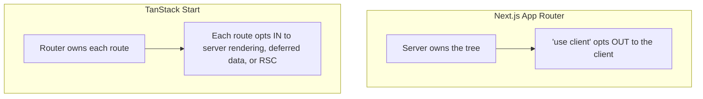

> **Verified against** `@tanstack/react-start` v1.168.x — July 2026.

## What it is

TanStack Start is a full-stack React framework built on top of TanStack Router, running on Vite. You get file-based routing, server-side rendering, streaming, and server functions (isomorphic RPC calls) — the same category of tool as Next.js or Remix.

The difference is philosophy, not feature count.

## The core difference

Next.js's App Router treats the server as the owner of your component tree. Your components run there by default, and the client is where you opt *in* to interactivity (`'use client'`).

TanStack Start flips that. The **router owns the app**. Server rendering, data loading, and (optionally) server components are things the router does *for* a route, not a mode the whole app lives in. Every route decides for itself how much of it runs on the server — see [selective SSR](../../02-rendering-model/03-selective-ssr/) for the actual mechanism (`ssr: true`, `'data-only'`, `false`).



Practically, this means Start doesn't ask you to buy into one rendering model for the whole app. A dashboard can SSR its shell and client-render a live-data widget in the same route tree, with no framework-level ceremony — just a per-route config value.

## The primitive you'll use everywhere: server functions

Almost everything in this book builds on one idea: a function that's defined once, runs on the server, and is called like a normal async function from anywhere — a loader, a component, another server function.

```ts
// src/server/get-user.ts
import { createServerFn } from '@tanstack/react-start'
import { z } from 'zod'

export const getUser = createServerFn({ method: 'GET' })
  .validator(z.object({ id: z.string() }))
  .handler(async ({ data }) => {
    // this code never ships to the browser
    return db.user.findUnique({ where: { id: data.id } })
  })
```

Call it from a route loader (`getUser({ data: { id } })`) or from a client component via `useServerFn(getUser)`. The framework compiles the server body out of the client bundle automatically — you don't write two versions of this function. Part 3 covers this in depth.

## When to reach for Start

- You want React with real SSR/streaming, but don't want Next.js's server-first conventions dictating your whole architecture.
- You're comfortable owning your Vite config and want a framework that stays close to it, rather than replacing it.
- You want to add server rendering incrementally to specific routes, not as an all-or-nothing switch.

If you want a mature, batteries-included RSC-first framework today, Next.js is further along on that specific axis — Start's RSC support is real but still experimental (Part 9, Appendix A). If you want isomorphic server functions and fine-grained per-route rendering control on a Vite-native stack, Start is built for exactly that.
