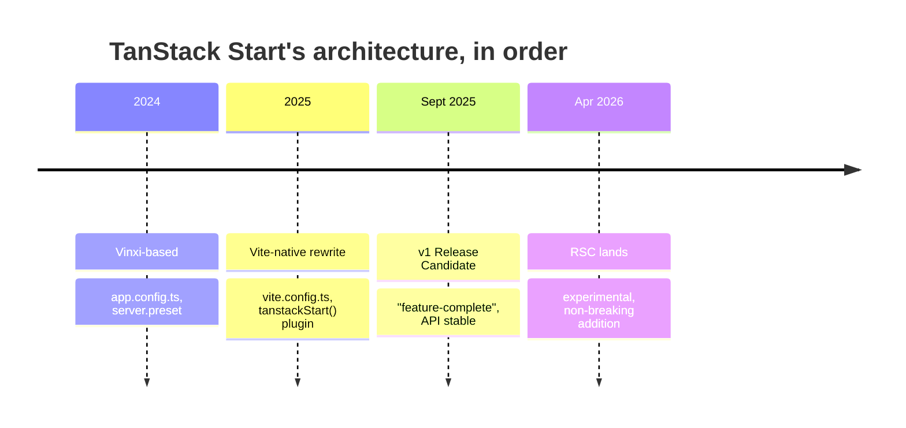

> **Verified against** `@tanstack/react-start` v1.168.x — July 2026.

## Read this before anything else

TanStack Start moves fast, and a lot of what you'll find by searching is already out of date. Two things to know before you read another page of this book.

**First: the version number lies to you.** Start ships inside the TanStack Router monorepo and shares its version line. `1.168.x` is not a maturity signal — it's just the monorepo's current build. Start's own docs still say "Release Candidate" as of this writing, even though the framework has been called "feature-complete" since late 2025. Treat it as **production-usable, but still settling** — not the same guarantee as a library on a stable `2.x`.

**Second: it moved off Vinxi.** Early Start used [Vinxi](https://vinxi.vercel.app/) and an `app.config.ts` file. That's gone. Current Start is a native Vite plugin, configured in a normal `vite.config.ts`. If you find a tutorial using `server.preset` or `app.config.ts`, it's describing the old architecture.



## Old vs. new config, side by side

If you see code like the left side below, mentally translate it — the right side is current.

```ts
// OLD — Vinxi-based, no longer how Start works
// app.config.ts
import { defineConfig } from '@tanstack/start/config'

export default defineConfig({
  server: { preset: 'vercel' },
})
```

```ts
// CURRENT — native Vite plugin
// vite.config.ts
import { defineConfig } from 'vite'
import { tanstackStart } from '@tanstack/react-start/plugin/vite'
import viteReact from '@vitejs/plugin-react'

export default defineConfig({
  plugins: [tanstackStart(), viteReact()], // order matters: start before react
})
```

The scaffolding CLI changed too: `@tanstack/create-start` is deprecated in favor of the unified `@tanstack/cli`.

## The stability legend used throughout this book

Every chapter opens with a version-pinned callout like the one at the top of this page. Beyond that, watch for these three labels on individual features:

| Label | Means | Example |
|---|---|---|
| 🟢 **Stable** | Documented, part of the RC feature set, safe to build on | Server functions, file-based routing, selective SSR |
| 🟡 **Experimental** | Works, is documented, but the API may still change | React Server Components (Part 9, Appendix A) |
| 🔴 **Community / inferred** | No official Start-specific docs — adapted from another framework's guidance or our own synthesis | Zustand/Jotai per-request patterns (Part 4) |

When a chapter uses 🔴, it's telling you to verify against current docs before you build production code on it — the pattern is reasonable, but nobody upstream has committed to it staying that way.
