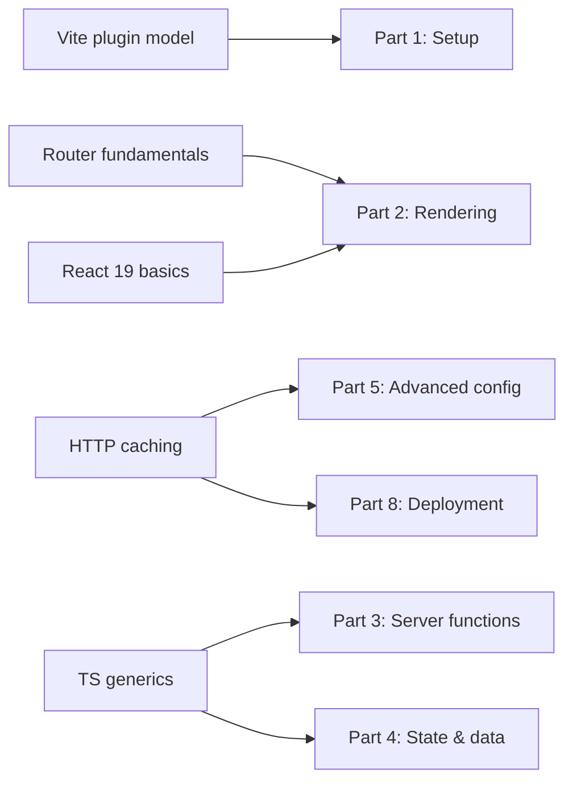

> **Verified against** `@tanstack/react-start` v1.168.x — July 2026.

This isn't a tutorial chapter — it's a checklist. If most of these feel shaky, this book will still make sense, but you'll want a second tab open to the linked docs.

## The checklist

- **Vite's plugin model.** You know what a Vite plugin does and that plugin *order* can matter. You don't need to have written one.
- **TanStack Router fundamentals.** File-based routes, loaders, `beforeLoad`, and route context aren't new concepts to you. Start is Router plus a server layer — if Router itself is unfamiliar, start there first.
- **React 19 basics.** Suspense, `use()`, and transitions. You don't need deep internals, just working familiarity.
- **HTTP caching.** You know roughly what `Cache-Control`, `stale-while-revalidate`, and a CDN cache do, even if you've never hand-written the headers.
- **TypeScript generics.** Start's value proposition is end-to-end type inference — a validator's output type flows into your handler's `data` type flows into your caller. When that inference breaks, you need enough generics comfort to read the error, not just paste it into a search engine.

## A quick self-test

If you can predict what `data` is typed as below without running it, you're in good shape for this book:

```ts
import { createServerFn } from '@tanstack/react-start'
import { z } from 'zod'

const schema = z.object({ userId: z.string(), limit: z.number().optional() })

const listOrders = createServerFn({ method: 'GET' })
  .validator(schema)
  .handler(async ({ data }) => {
    //            ^? what type is `data` here?
    return db.orders.findMany({ where: { userId: data.userId }, take: data.limit })
  })
```

`data` is `{ userId: string; limit?: number }` — inferred straight from the Zod schema, no manual typing. If that wasn't obvious, spend some time with TypeScript generics before Part 3; the whole server-function chapter leans on this kind of inference.

## How the skills map to the book



You don't need all five before starting — Part 1 only really needs Vite familiarity. But by Part 3, the TypeScript generics comfort stops being optional.
