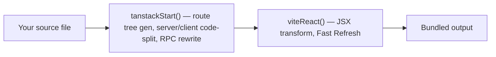

> **Verified against** `@tanstack/react-start` v1.168.x — July 2026.

## Scaffolding a new project

The current, supported way to start a project is the unified CLI:

```bash
npx @tanstack/cli@latest create
```

It prompts you for a package manager and optional add-ons (Tailwind CSS, ESLint, and a few others), then generates a working Vite + Start project.

:::danger
If a tutorial or blog post tells you to run `npx @tanstack/create-start`, that's the old, deprecated scaffolding package. It still exists on npm but prints a deprecation warning pointing at the unified CLI — don't build a new project on it. This mirrors the same Vinxi-era staleness problem covered in [00-orientation/02](../../00-orientation/02-version-and-stability/): a lot of search results for "TanStack Start setup" predate the current tooling.
:::

Two other starting points, if the CLI's prompts aren't what you want:

- **Clone an official example** — `npx gitpick TanStack/router/tree/main/examples/react/start-basic start-basic` gives you a working project without answering any prompts. There are variants for React Query, auth providers, and a few other stacks.
- **Build it by hand** — useful once, so you understand what the CLI generates for you. The rest of this chapter walks through that.

## Building it by hand

Skip this section if you scaffolded with the CLI — it already did this for you. It's worth reading once anyway, because it's the fastest way to understand what the plugin is actually doing.

Install the framework and its peer dependencies:

```bash
bun add @tanstack/react-start @tanstack/react-router react react-dom
bun add -D vite @vitejs/plugin-react typescript @types/react @types/react-dom @types/node
```

`package.json` needs `"type": "module"` and Vite-driven scripts:

```json
{
  "type": "module",
  "scripts": {
    "dev": "vite dev",
    "build": "vite build"
  }
}
```

## `vite.config.ts` — plugin order matters

This is the one file in the whole setup where getting the order wrong silently breaks things:

```ts
// vite.config.ts
import { defineConfig } from 'vite'
import { tanstackStart } from '@tanstack/react-start/plugin/vite'
import viteReact from '@vitejs/plugin-react'

export default defineConfig({
  resolve: {
    // path aliases from tsconfig.json — see the next chapter
    tsconfigPaths: true,
  },
  plugins: [
    tanstackStart(), // must come first
    viteReact(), // then React's plugin
  ],
})
```

`tanstackStart()` has to precede `viteReact()` in the `plugins` array. The official build-from-scratch guide states this as a hard requirement without publishing the internal transform details, so treat it as non-negotiable rather than a style preference.

The practical reason: Vite runs plugin transforms on each file in array order. Start's plugin does its own source-level work first — generating the route tree, splitting server-only code out of the client bundle, rewriting `createServerFn` calls into the RPC boundary. That has to happen against your original source. If React's plugin (which rewrites JSX and wires up Fast Refresh) ran first, Start's plugin would be parsing already-transformed output instead of the code you wrote, and route/server-function detection can break in ways that are hard to trace back to "plugin order." Put `tanstackStart()` first and this class of bug doesn't happen.



:::caution
This is the single most common "why doesn't my server function work" bug reported against fresh Start setups copied from outdated tutorials. If you inherit a `vite.config.ts` with the plugins in the other order, fix that before debugging anything else.
:::

## The two required files

Beyond `vite.config.ts`, Start needs exactly two files to boot:

```
src/
├── router.tsx        # createRouter() factory — shared by server and client
└── routes/
    └── __root.tsx     # the document shell — always rendered, no path
```

```tsx
// src/router.tsx
import { createRouter } from '@tanstack/react-router'
import { routeTree } from './routeTree.gen'

export function getRouter() {
  const router = createRouter({
    routeTree,
    scrollRestoration: true,
  })
  return router
}
```

`routeTree.gen.ts` doesn't exist yet at this point — it's generated the first time you run `vite dev`, from whatever you put in `src/routes/`. The next chapter covers that directory in depth.

## Rsbuild, briefly

Vite is the default and what this book uses throughout, but Start also supports [Rsbuild](https://rsbuild.dev/) as a build tool — same plugin-ordering concern applies (`pluginReact()` and `tanstackStart()` from `@tanstack/react-start/plugin/rsbuild`), configured in `rsbuild.config.ts` instead of `vite.config.ts`. If you're not already invested in the Rspack ecosystem, there's no reason to reach for it over Vite for a new project.
