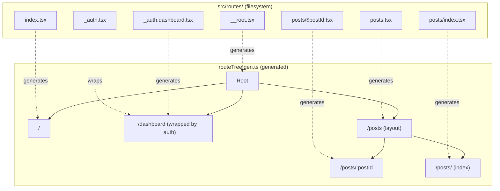

> **Verified against** `@tanstack/react-start` v1.168.x — July 2026.

Start's routing is TanStack Router's file-based routing, unchanged. If you've used Router standalone, skip to [Project structure for larger apps](#project-structure-for-larger-apps). If you're coming from Next.js or Remix, the conventions differ enough to be worth reading in full — see also [1.3](../03-coming-from-nextjs-remix-router/) for the direct concept mapping.

## Where routes live

Routes live in `src/routes` by default. The directory is configurable (`router.routesDirectory` in the `tanstackStart()` plugin options), but there's rarely a reason to change it — the one common exception is migrating from Next.js, where teams sometimes rename it to `app` purely to keep the diff smaller during migration.

```
src/
├── routes/
│   ├── __root.tsx       # required, always matched, renders the shell
│   ├── index.tsx        # "/"
│   ├── about.tsx        # "/about"
│   ├── posts.tsx         # layout route wrapping posts/*
│   └── posts/
│       └── $postId.tsx  # "/posts/:postId"
├── router.tsx
└── routeTree.gen.ts      # generated, don't hand-edit
```

## Segment conventions

| Filename pattern | Matches | Notes |
|---|---|---|
| `index.tsx` | exact parent path (`/` for root-level) | index route |
| `about.tsx` | `/about` | static route |
| `posts/$postId.tsx` | `/posts/:postId` | `$` prefix = dynamic param, read via `Route.useParams()` |
| `posts/$.tsx` | `/posts/*` (splat) | full remaining path lands in `params._splat` |
| `posts/{-$category}.tsx` | `/posts` **and** `/posts/tech` | `{-$param}` = optional param |
| `posts.tsx` | wraps `posts/*` children in a layout | ordinary layout route — appears in the URL |
| `_pathlessLayout.tsx` | wraps children, contributes nothing to the URL | `_` prefix = pathless layout route |
| `posts_.$postId.edit.tsx` | `/posts/:postId/edit`, **not** nested under `posts.tsx` | trailing `_` on the parent segment un-nests the route |
| `-components/`, `-helpers.tsx` | nothing — excluded from the route tree | `-` prefix lets you colocate non-route files inside `routes/` |
| `(marketing)/about.tsx` | `/about` | `()` wrapping = organizational group, invisible to the URL |

Two of these are worth a second look because they solve different problems that look similar at a glance:

- **Pathless layout routes** (`_auth.tsx`) give a group of routes shared logic — a `beforeLoad` auth check, a shared context, a shared error boundary — without adding a URL segment. `_auth.tsx` wrapping `_auth.dashboard.tsx` and `_auth.settings.tsx` produces `/dashboard` and `/settings`, both wrapped in whatever `_auth.tsx` renders.
- **Route groups** (`(marketing)/`) are purely a filesystem organization tool. They don't wrap anything and don't run any logic — they just let you group files in a folder without that folder name becoming a URL segment.

```tsx
// src/routes/posts/$postId.tsx
import { createFileRoute } from '@tanstack/react-router'

export const Route = createFileRoute('/posts/$postId')({
  loader: ({ params }) => fetchPost(params.postId),
  component: PostComponent,
})

function PostComponent() {
  const { postId } = Route.useParams()
  return <div>Post {postId}</div>
}
```

Note the string passed to `createFileRoute('/posts/$postId')` — that's not something you type by hand and hope is right. The Router Vite plugin (bundled inside `tanstackStart()`) writes and maintains it for you as you create, move, or rename route files.

## Folder tree → route tree



`routeTree.gen.ts` regenerates on every `dev`/`build` run. Commit it if you want CI type-checking to work without a build step first, but never hand-edit it — your changes disappear on the next regeneration.

## Path aliases

Start doesn't set up path aliases for you by default. Add one in `tsconfig.json`:

```json
{
  "compilerOptions": {
    "baseUrl": ".",
    "paths": {
      "~/*": ["./src/*"]
    }
  }
}
```

Then wire it into Vite. Which config you need depends on your Vite version:

**Vite 8 and later** has built-in tsconfig-paths support, off by default:

```ts
// vite.config.ts
export default defineConfig({
  resolve: {
    tsconfigPaths: true,
  },
})
```

**Vite 7 and earlier** needs the community plugin:

```bash
bun add -D vite-tsconfig-paths
```

```ts
// vite.config.ts
import viteTsConfigPaths from 'vite-tsconfig-paths'

export default defineConfig({
  plugins: [
    viteTsConfigPaths({ projects: ['./tsconfig.json'] }),
    tanstackStart(),
    viteReact(),
  ],
})
```

Either way, you now get:

```ts
import { Input } from '~/components/ui/input'
// instead of
import { Input } from '../../../components/ui/input'
```

## Project structure for larger apps

Once a project outgrows "a few routes and a couple of components," a few conventions keep the server/client boundary legible:

```
src/
├── routes/            # file-based routes — pages, layouts, server routes
├── server/            # server-only modules: db clients, auth checks, third-party SDKs
│   ├── auth.ts
│   └── db.ts
├── components/        # shared UI, imported by routes
├── start.ts           # the global Start instance — request middleware, defaultSsr
├── router.tsx          # createRouter() factory
└── server.ts           # optional custom server entry point
```

`src/routes/` and `src/router.tsx` are documented, load-bearing conventions — Start looks for them by name. `src/server/` as a directory is not a special, framework-recognized name; it's a convention this book (and most real Start codebases) uses to make "this file must never end up in the client bundle" visually obvious at a glance. Enforce that boundary for real with the `.server.ts` filename suffix or a `import '@tanstack/react-start/server-only'` marker import — Start's import-protection will fail the build if client code reaches into a marked module.

Two files are worth calling out specifically because they're easy to miss in the docs:

**`src/start.ts`** is where you configure the global Start instance — request-level middleware that runs for every request, and framework defaults like `defaultSsr` (covered in [2.3](../../02-rendering-model/03-selective-ssr/)):

```ts
// src/start.ts
import { createStart } from '@tanstack/react-start'
import { authMiddleware } from './server/auth'

export const startInstance = createStart(() => ({
  requestMiddleware: [authMiddleware],
}))
```

**`src/server.ts`** is an *optional* custom server entry point. If you don't provide one, Start handles it for you with sane defaults (streaming SSR via `defaultStreamHandler`). You only need it to customize the fetch handler — adding Cloudflare Workers bindings, wrapping the response, injecting a typed request context:

```ts
// src/server.ts
import handler, { createServerEntry } from '@tanstack/react-start/server-entry'

export default createServerEntry({
  fetch(request) {
    return handler.fetch(request)
  },
})
```

Part 5 covers custom server entries and code splitting in more depth once you're tuning a production build rather than just laying out the project.
