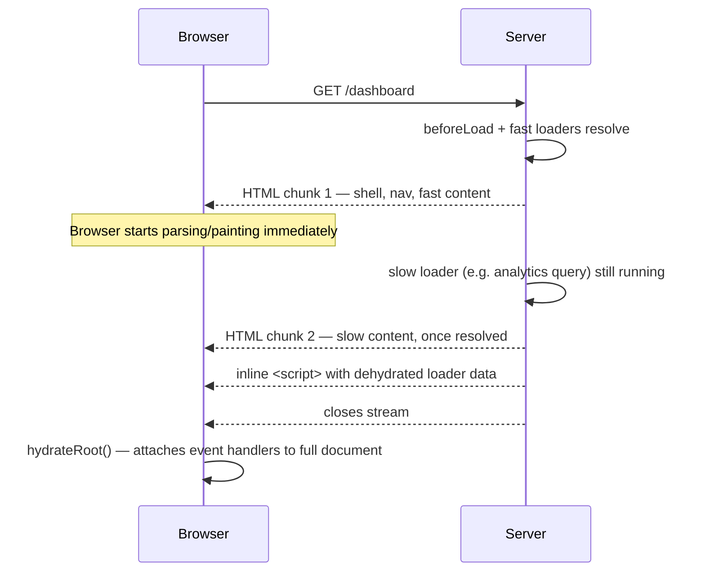

> **Verified against** `@tanstack/react-start` v1.168.x — July 2026.

## Full-document SSR by default

On the initial request to any route, Start renders the whole document server-side: `beforeLoad` runs, then `loader`, then the matched route components render to HTML. The response the browser gets is a complete page, not a shell waiting for JavaScript to fill it in.

This is the default for every route — you don't opt into it. What you *can* opt out of, per route, is covered in [2.3](../03-selective-ssr/): a route can tell Start to skip server-side loading, skip server-side rendering, or skip both. Absent that configuration, `ssr: true` is the default and everything above happens on the server.

```tsx
// src/routes/products/$productId.tsx
import { createFileRoute } from '@tanstack/react-router'
import { createServerFn } from '@tanstack/react-start'

const getProduct = createServerFn({ method: 'GET' })
  .validator((id: string) => id)
  .handler(async ({ data: id }) => {
    return db.product.findUniqueOrThrow({ where: { id } })
  })

export const Route = createFileRoute('/products/$productId')({
  loader: ({ params }) => getProduct({ data: params.productId }),
  component: ProductPage,
})

function ProductPage() {
  const product = Route.useLoaderData()
  return (
    <article>
      <h1>{product.name}</h1>
      <p>{product.description}</p>
    </article>
  )
}
```

On the first request, `getProduct` runs on the server, `ProductPage` renders to HTML server-side, and the browser gets a complete `<article>` with the product's name and description already in it — good for first paint and for anything crawling the page. On a later client-side navigation to a different `$productId`, the same `loader` runs again, but this time in the browser.

## Streaming SSR

Non-streaming SSR waits for everything — every loader, every nested route's render — before sending a single response. Streaming SSR sends the critical first paint as soon as it's ready, then keeps the connection open and streams the rest of the page in as it resolves, in the same request.

This matters most when a page has one slow data dependency blocking otherwise-fast content. Without streaming, the slowest loader on the page determines time-to-first-byte for the whole response. With streaming, fast content ships immediately and slow content arrives as a chunk appended to the same HTML stream, with no second request and no client-side loading spinner replacing already-rendered markup.



Streaming is automatic — you don't configure a streaming vs. non-streaming mode. It's built into how Start's default server handler renders the router. Loader data is dehydrated (serialized into the HTML as inline data) and rehydrated on the client without you writing any of that plumbing by hand.

## Where this actually happens

Start ships a default server entry point that wires up `defaultStreamHandler` for you — most apps never write an `entry-server.tsx` at all. If you need to customize the render path (inject a request context, wrap the response, add Cloudflare Workers bindings), you do that in `src/server.ts`, covered in [1.2](../../01-setup-and-architecture/02-file-based-routing-and-project-structure/#project-structure-for-larger-apps) and in more depth in [Part 5](../../05-advanced-config/03-code-splitting-and-server-entry/). For everyday route-building, you don't need to think about the render pipeline — you write loaders and components, and streaming SSR happens underneath them.

:::caution
Serialization has real limits. Out of the box, Start's dehydration supports `undefined`, `Date`, `Error`, and `FormData` beyond what plain `JSON.stringify` handles. `Map`, `Set`, `BigInt`, and other exotic types are **not** serialized by default — returning one from a loader either breaks or silently loses data on the client. Convert to a plain array/object/string before returning it from a loader, or reach for a custom serializer if you genuinely need one of these types across the wire.
:::

## Hydration, briefly

Once the streamed HTML finishes arriving, the client hydrates the whole document — every route component that was server-rendered attaches its event handlers and becomes interactive. This is a full-tree hydration, not RSC's per-component "only hydrate the client components" model (see [1.3](../../01-setup-and-architecture/03-coming-from-nextjs-remix-router/) if that distinction is new). [2.4](../04-boundaries-and-hydration/) covers hydration mismatches and how error/pending boundaries scope to route regions during this process.
