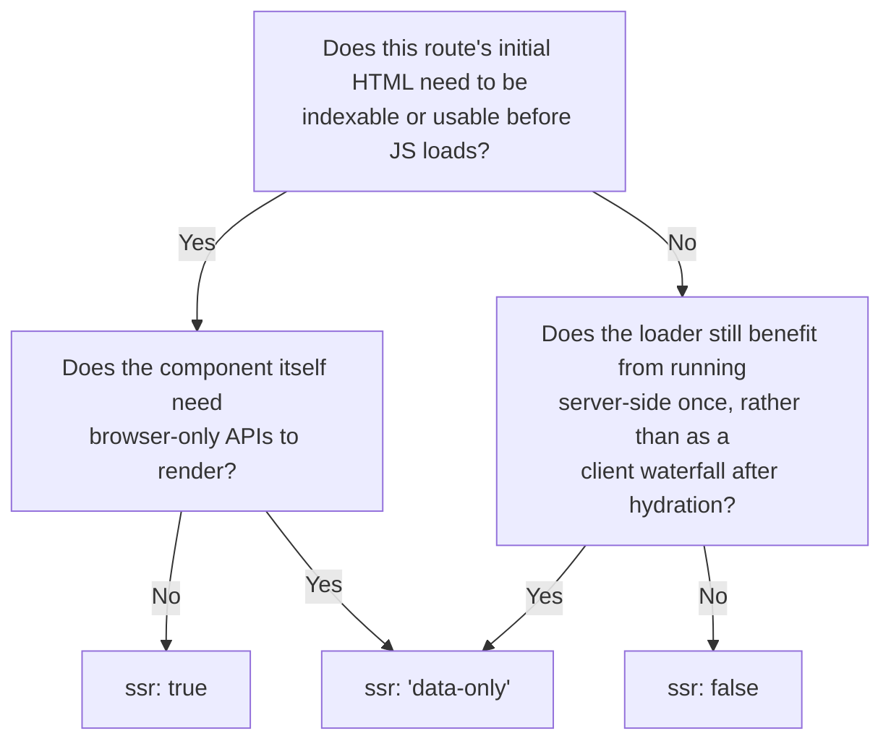

> **Verified against** `@tanstack/react-start` v1.168.x — July 2026.

Every matched route decides, on its own, how much of it runs on the server for the initial request. That's the `ssr` route option, and it's the mechanism behind the "router owns rendering, per-route" philosophy introduced in [00-orientation/01](../../00-orientation/01-why-tanstack-start/).

This is a distinct feature from [SPA mode](../../05-advanced-config/01-prerendering-and-spa-mode/), which turns SSR off for the *entire app*. Selective SSR lets you make that call per route, and even dynamically per request.

## The three values

### `ssr: true` — the default

`beforeLoad` and `loader` run on the server, their results are sent to the client, and the component renders to HTML server-side.

```tsx
export const Route = createFileRoute('/posts/$postId')({
  ssr: true, // this is the default; shown explicitly here
  beforeLoad: () => {
    console.log('server, on initial request; client, on later navigation')
  },
  loader: () => {
    console.log('server, on initial request; client, on later navigation')
  },
  component: () => <div>Rendered server-side on first load</div>,
})
```

### `ssr: false` — fully client-rendered

Nothing about this route runs server-side. `beforeLoad`, `loader`, and the component all execute in the browser during hydration instead.

```tsx
export const Route = createFileRoute('/canvas-editor')({
  ssr: false,
  loader: () => {
    console.log('client only — this never runs on the server')
  },
  component: () => <CanvasEditor />, // safe to touch `window`, canvas, etc.
})
```

Reach for this when the route's `loader` or component depends on something that flatly doesn't exist on the server — `localStorage`, `canvas`, `window`, a browser-only SDK.

### `ssr: 'data-only'` — the hybrid

`beforeLoad` and `loader` run server-side and their data ships to the client as usual, but the component does **not** render on the server.

```tsx
export const Route = createFileRoute('/posts/$postId/preview')({
  ssr: 'data-only',
  loader: ({ params }) => fetchPost(params.postId), // server-side, as normal
  component: () => <RichTextPreview />, // client-rendered — needs a browser-only editor lib
})
```

Use this when the *data* is worth fetching server-side (SEO doesn't need the component's HTML, but you still want the request to happen once, server-side, rather than as a client-side waterfall after hydration) but the component itself can't render outside a browser.

## Deciding which one a route needs



In practice: default to `ssr: true` and only reach for the other two when something concrete forces your hand — a browser-only API in the component (`'data-only'`), or a page where server rendering buys you nothing and you'd rather skip the server work entirely (`false`). [Part 6.1](../../06-patterns/01-shell-pattern/) and [6.3](../../06-patterns/03-trading-realtime-pattern/) walk through real routes that land on each value.

## Deciding at runtime

`ssr` also accepts a function, evaluated server-side only, for cases where the right value depends on params or search params:

```tsx
export const Route = createFileRoute('/docs/$docType/$docId')({
  validateSearch: z.object({ details: z.boolean().optional() }),
  ssr: ({ params, search }) => {
    if (params.status === 'success' && params.value.docType === 'sheet') {
      return false
    }
    if (search.status === 'success' && search.value.details) {
      return 'data-only'
    }
    // falls through to the default (true)
  },
  component: () => <DocViewer />,
})
```

`params` and `search` arrive as a discriminated union (`{ status: 'success', value }` or `{ status: 'error', error }`) so you can react to validation failures explicitly. The function itself is stripped from the client bundle — it only ever runs on the server, during the initial request.

## Inheritance: child routes can only get more restrictive

A child route inherits its parent's `ssr` setting. It can tighten it further, but it can't loosen it — the ordering is `true` → `'data-only'` → `false`, and a child can only move rightward, never left.

```
root { ssr: undefined }        →  defaults to true
  posts { ssr: 'data-only' }   →  loader runs server-side, component doesn't render server-side
    $postId { ssr: true }      →  has no effect; inherits 'data-only' from `posts`
      details { ssr: false }   →  more restrictive than inherited 'data-only' — wins
```

If a parent route has locked in `false`, nothing under it can opt back into server rendering by setting `ssr: true` — that value is simply ignored in favor of the inherited, more restrictive one.

## Fallback rendering

For the first route in the tree with `ssr: false` or `'data-only'`, the server renders that route's `pendingComponent` (or the router's `defaultPendingComponent`) as a placeholder, if one is configured. On the client, that placeholder stays visible for at least `minPendingMs` during hydration, even if the route has no `loader`/`beforeLoad` at all. [2.4](../04-boundaries-and-hydration/) covers pending components in more depth.

## Setting the default for the whole app

Per-route `ssr` overrides a global default set in `src/start.ts`:

```ts
// src/start.ts
import { createStart } from '@tanstack/react-start'

export const startInstance = createStart(() => ({
  defaultSsr: false, // e.g. for an app that's mostly client-rendered by default
}))
```

## The root route is a special case

You can disable SSR for the root route's own `component`, but the document shell — the `<html>`, `<head>`, `<Scripts>` — still has to render server-side; there's no HTML to send the browser otherwise. That shell lives in a separate `shellComponent`, which is always server-rendered regardless of the root's `ssr` value:

```tsx
export const Route = createRootRoute({
  ssr: false, // applies to `component`, not `shellComponent`
  shellComponent: RootShell, // always SSR'd
  component: RootComponent, // client-rendered only, per `ssr: false` above
})

function RootShell({ children }: { children: React.ReactNode }) {
  return (
    <html>
      <head><HeadContent /></head>
      <body>
        {children}
        <Scripts />
      </body>
    </html>
  )
}
```
