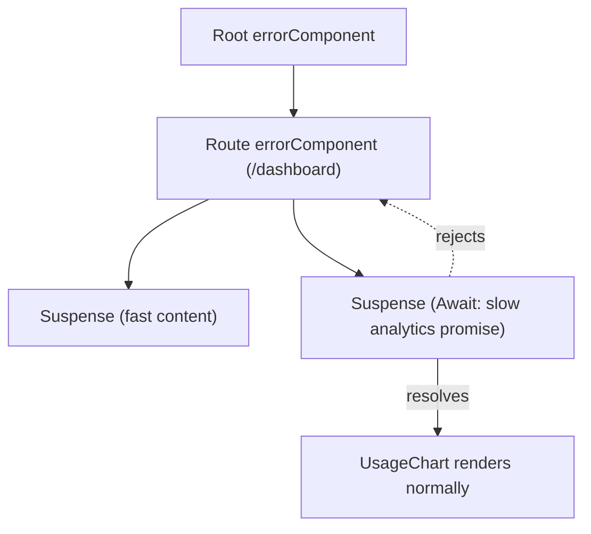

> **Verified against** `@tanstack/react-start` v1.168.x — July 2026.

## Pending components, scoped per route

Every route can define its own `pendingComponent`, shown while that route's `loader` is still resolving. By default, Start (via Router) only shows it if the loader takes longer than 1 second — an optimistic threshold, so fast loaders never flash a spinner:

```tsx
export const Route = createFileRoute('/reports/$reportId')({
  loader: ({ params }) => generateReport(params.reportId), // can be slow
  pendingComponent: () => <ReportSkeleton />,
  pendingMs: 1_000, // default — override per route if needed
  pendingMinMs: 500, // once shown, stays up at least this long (avoids flicker)
})
```

Both thresholds have router-wide defaults (`defaultPendingMs`, `defaultPendingMinMs` on `createRouter`) you can override globally instead of per route. `pendingMinMs` exists specifically to prevent the pending component from flashing on screen for 50ms if the data resolves right after the threshold trips — without it, you'd get a visible flicker on borderline-slow loads.

Because `pendingComponent` is a route option, it's scoped to that route's region of the tree — a slow nested route shows its own pending state without blanking out the parent layout around it.

## Error boundaries, scoped per route

Same shape, for errors. A route-level `errorComponent` catches errors thrown by that route's `beforeLoad`, `loader`, or render — without taking down routes above it in the tree:

```tsx
import type { ErrorComponentProps } from '@tanstack/react-router'

function PostError({ error, reset }: ErrorComponentProps) {
  return (
    <div>
      <p>Couldn't load this post: {error.message}</p>
      <button onClick={() => reset()}>Try again</button>
    </div>
  )
}

export const Route = createFileRoute('/posts/$postId')({
  loader: ({ params }) => fetchPost(params.postId),
  errorComponent: PostError,
})
```

`reset()` clears the error boundary's internal state and re-attempts rendering the route's normal children — useful for a "retry" button that doesn't require a full page reload. If the error came from the loader itself (not just rendering), prefer `router.invalidate()` over `reset()` — it forces the loader to actually re-run, then resets the boundary as a side effect:

```tsx
function PostError({ error }: ErrorComponentProps) {
  const router = useRouter()
  return (
    <button onClick={() => router.invalidate()}>Retry</button>
  )
}
```

Set a default for the whole app on the router, and let individual routes override it only where they need something more specific:

```tsx
// src/router.tsx
export function getRouter() {
  return createRouter({
    routeTree,
    defaultErrorComponent: ({ error }) => <ErrorComponent error={error} />,
  })
}
```

`ErrorComponent` here is Router's own built-in fallback UI — a reasonable default to render from inside your custom error components too, for error types you didn't anticipate:

```tsx
errorComponent: ({ error }) => {
  if (error instanceof PaymentDeclinedError) {
    return <PaymentDeclinedNotice error={error} />
  }
  return <ErrorComponent error={error} /> // fall back to the built-in UI
}
```

## Deferred rejections land in the same boundary

Promises passed through `<Await>` ([2.2](../02-loaders-and-deferred-data/)) that reject don't fail silently or crash the whole page — the rejection is thrown from inside the `Await` component and caught by the nearest error boundary above it, same as a synchronous render error would be.



Practically: if `getUsageAnalytics()` from the earlier chapter's example rejects, that error bubbles to `/dashboard`'s `errorComponent` — not to the root's. Scope your error boundaries at the route level where a failure should actually be contained, not just at the root, or one flaky deferred promise takes out more of the page than it needs to.

## Hydration mismatches

A hydration mismatch happens when the HTML the server sent doesn't match what React renders on the client during hydration. Common causes: locale/timezone formatting (`Intl`, `toLocaleString()`), `Date.now()`/`Math.random()` used directly in render, and anything gated on a media query or feature flag that isn't known identically on both sides.

```tsx
// ❌ server and client format this differently unless their locale/timezone happen to match
function CurrentTime() {
  return <div>{new Date().toLocaleString()}</div>
}
```

Four ways to fix this, roughly in order of preference:

**1. Make server and client agree on the input.** Pick a deterministic locale/timezone server-side (from a cookie, falling back to `Accept-Language`), and format with that instead of ambient state:

```tsx
const getServerNow = createServerFn().handler(async () => {
  const locale = getCookie('locale') || 'en-US'
  const timeZone = getCookie('tz') || 'UTC'
  return new Intl.DateTimeFormat(locale, { dateStyle: 'medium', timeStyle: 'short', timeZone }).format(new Date())
})

export const Route = createFileRoute('/')({
  loader: () => getServerNow(),
  component: () => <time>{Route.useLoaderData()}</time>,
})
```

**2. Let the client tell the server its real environment, one round trip later.** Set a cookie with the client's actual timezone on first visit (via `<ClientOnly>` so it doesn't itself cause a mismatch), and use it server-side on the *next* request. The first response is deterministically `UTC` until then.

**3. Make it client-only.** Wrap anything inherently unstable in `<ClientOnly>` — it renders the fallback server-side and the real thing only after hydration, so there's nothing to mismatch:

```tsx
import { ClientOnly } from '@tanstack/react-router'

<ClientOnly fallback={<span>—</span>}>
  <RelativeTime ts={someTimestamp} />
</ClientOnly>
```

**4. Disable SSR for the route**, via [selective SSR](../03-selective-ssr/), if the whole component can't produce stable server HTML:

```tsx
export const Route = createFileRoute('/unstable')({
  ssr: 'data-only', // or false
  component: () => <ExpensiveViz />,
})
```

As a genuine last resort, React's `suppressHydrationWarning` silences the warning for one specific, known-different node — reach for it only after ruling out the above, and only on the smallest possible element:

```tsx
<time suppressHydrationWarning>{new Date().toLocaleString()}</time>
```

:::caution
`suppressHydrationWarning` hides the symptom, not the cause — it doesn't fix the mismatch, it just stops React from telling you about it. Use it for content you've deliberately decided is allowed to differ (a live clock), never as a way to make an unexplained warning go away.
:::

## Not to be confused with: Deferred Hydration

🟡 **Experimental.** Separately from deferred *data* loading, Start also has a feature literally called Deferred Hydration — a `<Hydrate>` component (`@tanstack/react-start`, strategies from `@tanstack/react-start/hydration`) that delays *when a server-rendered subtree becomes interactive*, independent of whether its data is ready. It's aimed at below-the-fold content and expensive widgets that should be visible immediately but don't need to hydrate immediately. It's a distinct, newer, experimental feature from the `Await`-based pattern in this chapter and [2.2](../02-loaders-and-deferred-data/) — worth knowing the name exists so a search for "deferred hydration" doesn't lead you to conflate the two, but treat it as unsettled API surface rather than something to reach for by default today.
