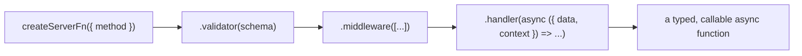

> **Verified against** `@tanstack/react-start` v1.168.x — July 2026.

A server function is a function you define once, that runs only on the server, and that you call like a normal async function from anywhere in your app — a loader, a component, another server function. This chapter covers its shape in detail. [Part 3.2](../../03-server-functions-forms-security/02-rpc-compile-boundary/) covers how the build actually makes that isomorphic call work.

## The chain

`createServerFn` returns a builder. Each call in the chain narrows the type of the next:



- **`createServerFn({ method })`** — `method` is `'GET'` or `'POST'` (defaults to `'GET'`). This picks the HTTP verb the RPC call uses under the hood; it's not just documentation. `GET` calls can be cached like any other GET request; `POST` calls can accept `FormData`.
- **`.validator(schemaOrFn)`** — validates and types the input. Takes either a bare function `(input: unknown) => T` or a [Standard Schema](https://standardschema.dev)-compatible validator like Zod. Its return type becomes the type of `data` in the handler.
- **`.middleware([...])`** — attaches reusable server/client logic (auth, logging, context injection). Covered in depth in [Part 3.3](../../03-server-functions-forms-security/03-middleware/).
- **`.handler(async ({ data, context }) => ...)`** — the actual implementation. This is the only part of the chain that's guaranteed to never reach the client bundle.

## Extending the example from Part 0

[Part 0.3](../../00-orientation/03-prerequisite-skills/) showed a bare-bones `listOrders` function. Here's the same function with a schema validator and a middleware attached — the shape you'll actually write in a real app:

```ts
// src/server/orders.ts
import { createServerFn } from '@tanstack/react-start'
import { z } from 'zod'
import { authMiddleware } from './middleware/auth'

const listOrdersInput = z.object({
  userId: z.string(),
  limit: z.number().int().positive().max(100).optional(),
})

export const listOrders = createServerFn({ method: 'GET' })
  .validator(listOrdersInput)
  .middleware([authMiddleware])
  .handler(async ({ data, context }) => {
    // `data` is { userId: string; limit?: number } — inferred from the schema
    // `context` includes whatever authMiddleware attached (e.g. `session`)
    if (context.session.userId !== data.userId) {
      throw new Error('Forbidden')
    }
    return db.orders.findMany({
      where: { userId: data.userId },
      take: data.limit ?? 20,
    })
  })
```

`db`, the query itself, and the shape of your ORM never ship to the browser. What ships is a fetch stub with the same type signature — see the next chapter for exactly what that stub looks like.

## The validator: bare function or schema

The simplest validator is an identity function with a type annotation:

```ts
const echo = createServerFn({ method: 'POST' })
  .validator((data: { message: string }) => data)
  .handler(async ({ data }) => data.message.toUpperCase())
```

This gives you the type without runtime checking — fine for internal tools, risky for anything taking user input. For real input validation, use a schema library. Zod is what you'll see most often in Start code, but any [Standard Schema](https://standardschema.dev) library (Valibot, ArkType, Effect Schema) works the same way:

```ts
const schema = z.object({ userId: z.string(), limit: z.number().optional() })

const listOrders = createServerFn({ method: 'GET' })
  .validator(schema)
  .handler(async ({ data }) => {
    //            ^? { userId: string; limit?: number }
  })
```

:::caution
The validator runs on the server, not just in the browser. Don't treat client-side form validation as a substitute for this — a request can always be crafted by hand, bypassing whatever UI you built. [Part 3.4](../../03-server-functions-forms-security/04-security-baseline/) covers this in more depth.
:::

## Serialization constraints

Because a server function call crosses a network boundary (even when you're calling it from another server function, in production it's the same RPC shape), inputs and outputs have to be serializable:

- Validator input types must be serializable. `FormData` is also allowed for `POST` functions — see [Part 3.5](../../03-server-functions-forms-security/05-forms/) for the forms use case.
- Handler return types must be serializable. Returning a `Response` object directly is also allowed, which is how you'd stream a file or set custom headers on the way out.

If you need to bypass this checking for a specific case (an escape hatch, not a default), `createServerFn({ strict: false })` — or `{ strict: { input: false } }` / `{ strict: { output: false } }` to loosen just one side — disables it.

## Isomorphic, end-to-end typed

The point of this whole chain is that you write the function once and TypeScript infers the same types wherever you call it from:

```ts
// in a loader
export const Route = createFileRoute('/orders/$userId')({
  loader: ({ params }) => listOrders({ data: { userId: params.userId } }),
})

// in a component, via useServerFn (see Part 3.2)
const callListOrders = useServerFn(listOrders)
const { data } = useQuery({
  queryKey: ['orders', userId],
  queryFn: () => callListOrders({ data: { userId } }),
})
```

Both call sites get full autocomplete on `data`, and both get the inferred return type back. There's no separate API client to maintain, no OpenAPI schema to regenerate — the handler's types *are* the contract.

:::tip
If you're used to Next.js Server Actions, the closest analogue is a `'use server'` function — but `createServerFn` supports `GET` as well as `POST` (Server Actions are POST-only), and it has a dedicated validator step rather than leaving input parsing to you by convention.
:::

Next: [3.2 — The RPC compile boundary](../../03-server-functions-forms-security/02-rpc-compile-boundary/) covers exactly how this isomorphic call works — what code the build strips, and the calling-convention differences between loaders and client components.
