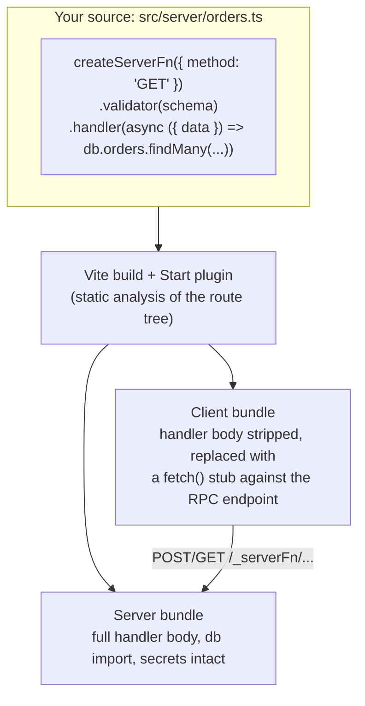

> **Verified against** `@tanstack/react-start` v1.168.x — July 2026.

`createServerFn` looks like one function, but the build produces two versions of it: a server version with your real handler, and a client version that's just a fetch call to that handler. This chapter covers how that split happens and the two calling conventions you'll use day to day.

## What the build does

Start's Vite plugin does static analysis over your route tree and finds every `createServerFn(...).handler(...)` call. For each one, it:

1. Keeps the full definition — validator, middleware, handler body — in the **server bundle**.
2. Replaces the handler body in the **client bundle** with a stub that does `fetch()` against a generated RPC endpoint for that function.



The practical effect: `db`, your ORM, API keys read from `process.env`, anything the handler body touches that you didn't explicitly also use client-side — none of it reaches the browser. You don't maintain two files. You write one function, and the boundary is enforced by the compiler, not by convention.

:::caution
This extraction relies on **static analysis** of `import` statements. Server functions must be **statically imported** — `import { listOrders } from './orders'` at the top of the file. Dynamic imports (`await import('./orders')`) can defeat the analysis: the plugin may not reliably find and split the call, which can leak server code into the client bundle or simply fail to build the RPC stub. If you need code-splitting around a route that uses server functions, split the route, not the server function import.
:::

## Two ways to call a server function

### From a loader, or another server function — call it directly

Inside a loader, `beforeLoad`, or another server function, just call it like a normal async function:

```ts
// routes/orders.$userId.tsx
import { createFileRoute } from '@tanstack/react-router'
import { listOrders } from '../server/orders'

export const Route = createFileRoute('/orders/$userId')({
  loader: ({ params }) => listOrders({ data: { userId: params.userId } }),
})
```

This code runs on the server during SSR, so calling `listOrders` here is a direct in-process call — no HTTP round trip, no serialization overhead beyond what the validator already does.

### From a client component — go through `useServerFn`

Inside a component that runs (or might run) on the client, wrap the import with `useServerFn`:

```tsx
import { useServerFn } from '@tanstack/react-start'
import { useQuery } from '@tanstack/react-query'
import { listOrders } from '../server/orders'

function OrdersPanel({ userId }: { userId: string }) {
  const callListOrders = useServerFn(listOrders)

  const { data } = useQuery({
    queryKey: ['orders', userId],
    queryFn: () => callListOrders({ data: { userId } }),
  })

  return <OrdersList orders={data} />
}
```

`useServerFn` binds the call to the current router/request context (so things like redirects and aborted-navigation handling work correctly) and gives you back the client-safe stub — the same function reference, just pointed at the fetch call instead of the handler body. You can call `listOrders(...)` directly without the hook and it will usually still work, but you lose that context binding; `useServerFn` is the documented, supported path from components.

:::note
Calling from a loader and calling from a component aren't actually two different APIs — it's the same function either way. The distinction is *where the call executes*: a loader runs during SSR (or client-side navigation) as part of the router's data flow, so it just calls through. A component render on the client needs the RPC stub, which is what `useServerFn` gives you access to correctly.
:::

## Request and response primitives

Inside a handler (or request middleware — see [Part 3.3](../../03-server-functions-forms-security/03-middleware/)), you get access to the underlying request/response via helpers from `@tanstack/react-start/server`:

```ts
import { createServerFn } from '@tanstack/react-start'
import {
  getRequest,
  getRequestHeader,
  setResponseHeaders,
  setResponseStatus,
} from '@tanstack/react-start/server'
import { redirect, notFound } from '@tanstack/react-router'

export const getSecret = createServerFn({ method: 'GET' }).handler(async () => {
  const request = getRequest()
  const auth = getRequestHeader('authorization')

  if (!auth) {
    throw redirect({ to: '/login' })
  }

  const secret = await lookupSecret(request)
  if (!secret) {
    throw notFound()
  }

  setResponseStatus(200)
  setResponseHeaders({ 'Cache-Control': 'private, max-age=60', Vary: 'Cookie' })
  return secret
})
```

- **`getRequest()`** — the full `Request` object for the current call.
- **`getRequestHeader(name)`** — read a single header without pulling the whole request apart.
- **`setResponseHeaders(headers)`** / a singular `setResponseHeader(name, value)` — set headers on the response the RPC stub will receive.
- **`setResponseStatus(code)`** — set the HTTP status.
- **`throw redirect({ to })`** — imported from `@tanstack/react-router`, not the server package. Throwing it from a handler or loader triggers a navigation on the client and a real HTTP redirect during SSR.
- **`throw notFound()`** — same import, renders the route's `notFoundComponent`.

:::danger
Watch the `Cache-Control` value on anything that reads a cookie, session, or auth header, or otherwise branches on identity. `public, max-age=...` tells any shared cache (a CDN, a reverse proxy) that the response is the same for everyone — for an authenticated response, that's a cross-tenant data leak: user A's response gets served to user B. Use `private` (and `Vary` on whatever the response depends on) for anything identity-scoped.
:::

## Why the split matters in practice

Because the server body is compiled out — not just hidden by convention — you can freely import server-only packages (a database driver, an S3 SDK, a secrets manager client) directly inside a handler file without a bundler ever trying to ship them to the browser. That's different from, say, hand-rolling a `fetch('/api/...')` call to a Next.js API route, where you're responsible for keeping the client and server code physically separate yourself.

The tradeoff is the constraint above: the compiler needs to *see* the call statically to do this. If you're ever unsure whether a server function's code leaked into the client bundle, check your build's client chunk for the handler's import (a database driver name showing up in a client chunk is the tell) rather than assuming.

Next: [3.3 — Middleware](../../03-server-functions-forms-security/03-middleware/) covers request vs. server-function middleware, and how context flows through the chain shown above.
