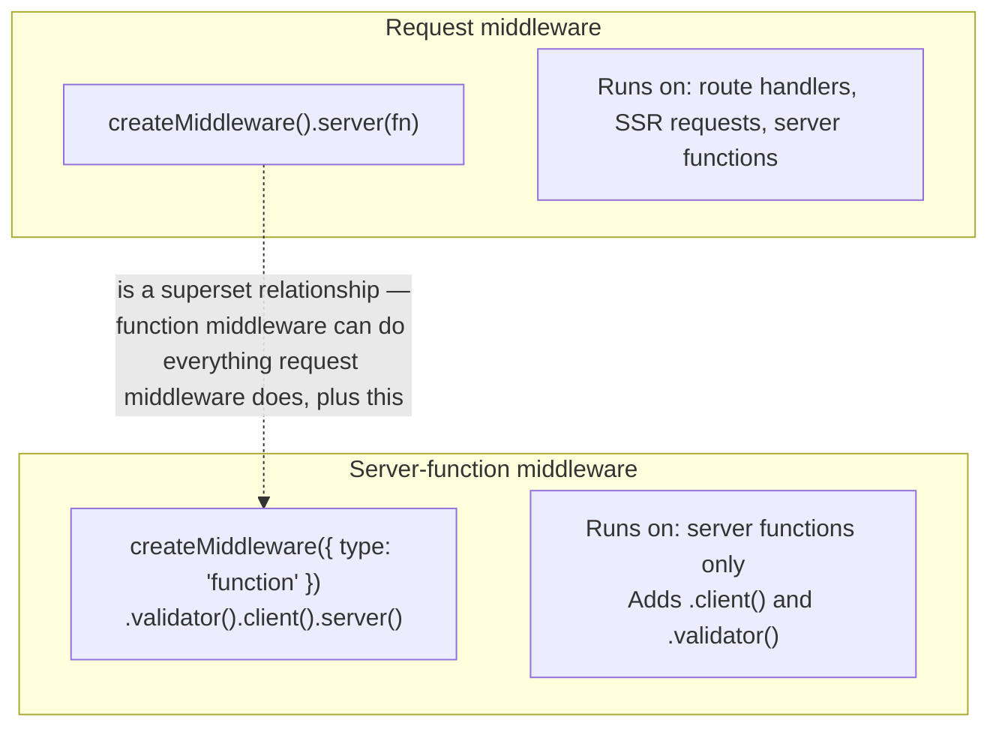
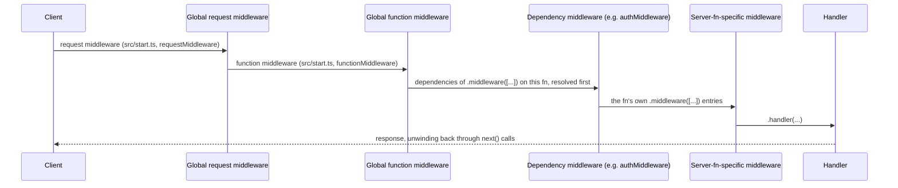

> **Verified against** `@tanstack/react-start` v1.168.x — July 2026.

Start has one middleware primitive, `createMiddleware`, used two ways: **request middleware**, which runs on every server request (routes, SSR, server functions alike), and **server-function middleware**, a superset with extra hooks specifically for the client/server RPC boundary.

## Request middleware vs. server-function middleware



Request middleware is the plain version — it only has `.server()` and `.middleware()` (for composing with other middleware). Server-function middleware adds `.validator()` (to validate/transform data before the chain runs) and `.client()` (logic that wraps the RPC call itself, on the client side, before the request goes out).

```ts
import { createMiddleware } from '@tanstack/react-start'

// Request middleware — applies to any server request
const loggingMiddleware = createMiddleware().server(async ({ next, request }) => {
  const start = Date.now()
  const result = await next()
  console.log(`${request.method} ${request.url} — ${Date.now() - start}ms`)
  return result
})

// Server-function middleware — client() only exists here
const authedFetch = createMiddleware({ type: 'function' })
  .client(async ({ next }) => {
    return next({ headers: { Authorization: `Bearer ${getClientToken()}` } })
  })
  .server(async ({ next, context }) => {
    const session = await auth.getSession()
    return next({ context: { session } })
  })
```

## Context: `next({ context })` vs. `next({ sendContext })`

Every middleware step must call `next()` to continue the chain (or skip it to short-circuit — throw a redirect, an error, whatever you need). What you pass to `next()` controls what the *next* step sees:

- **`next({ context })`** — attaches data to the server-side context, visible to downstream middleware and the handler. This never leaves the server.
- **`next({ sendContext })`** — used inside `.client()` to send data *from the client to the server* as part of the RPC call. This crosses the network.

```ts
const workspaceMiddleware = createMiddleware({ type: 'function' })
  .client(async ({ next, context }) => {
    // client → server: explicit opt-in transmission
    return next({ sendContext: { workspaceId: context.workspaceId } })
  })
  .server(async ({ next, context }) => {
    // context.workspaceId is now available here — but it came from the client
    return next({ context: { workspaceId: context.workspaceId } })
  })
```

:::danger
`sendContext` is client-supplied data. Treat it exactly like a request body or a header — validate it, and never use it directly for an authorization decision. A user can set `workspaceId` to anything before it's sent. Derive the *actual* session and its permissions from a cookie plus a server-side lookup (see [Part 3.4](../../03-server-functions-forms-security/04-security-baseline/)), and if you also receive a client-asserted value like `workspaceId` via `sendContext`, check it against the server-derived session before trusting it for anything that matters.
:::

`next({ context })` on the server side has the opposite trust direction — it's server-computed and safe to build authorization on, as long as the middleware that set it did its own validation first.

## Chaining and dependency middleware

A middleware can depend on other middleware via `.middleware([...])`, and a server function attaches its middleware chain the same way:

```ts
// A base auth check that derives a session
export const authMiddleware = createMiddleware().server(async ({ next, request }) => {
  const session = await auth.getSession({ headers: request.headers })
  if (!session) throw new Error('Unauthorized')
  return next({ context: { session } })
})

// A factory that builds on authMiddleware — permissions vary per call site
export function authorizationMiddleware(permissions: Permissions) {
  return createMiddleware({ type: 'function' })
    .middleware([authMiddleware])
    .server(async ({ next, context }) => {
      const granted = await auth.hasPermission(context.session, permissions)
      if (!granted) throw new Error('Forbidden')
      return next()
    })
}

export const getClients = createServerFn()
  .middleware([authorizationMiddleware({ client: ['read'] })])
  .handler(async ({ context }) => {
    // context.session is available here, inherited through the dependency chain
    return db.clients.findMany()
  })
```

This factory pattern — a function that returns a configured middleware — is how you avoid writing a near-duplicate auth check per permission level.

## Global registration: `src/start.ts`

Middleware you want applied everywhere gets registered once, via `createStart`:

```ts
// src/start.ts
import { createStart } from '@tanstack/react-start'
import { loggingMiddleware } from './server/middleware/logging'
import { authMiddleware } from './server/middleware/auth'

export const startInstance = createStart(() => ({
  requestMiddleware: [loggingMiddleware],   // every request: routes, SSR, server fns
  functionMiddleware: [authMiddleware],     // server functions only
}))
```

`requestMiddleware` runs for anything the server handles — page requests, SSR renders, server-function calls. `functionMiddleware` narrows that to server functions specifically. Use `requestMiddleware` for cross-cutting concerns like logging or security headers; use `functionMiddleware` for things that only make sense in the RPC context, like the auth middleware from above (if you want it applied to *every* server function without listing it on each one).

## Execution order

Middleware runs **dependency-first**: a middleware's own `.middleware([...])` dependencies resolve before the middleware itself runs. Layered on top of that, the overall order for a given server-function call is:



In short: global middleware from `src/start.ts` runs before anything attached to the specific server function, and within a function's own middleware list, dependencies resolve before the middleware that declared them. Route-level `server: { middleware: [...] }` (attached in `createFileRoute`) follows the same dependency-first rule scoped to that route.

## Tree-shaking by environment

Middleware code is environment-aware the same way server functions are: `.server()` bodies are stripped from the client bundle, `.client()` bodies never run on the server. You get one middleware definition, split the same way `createServerFn` handler bodies are split — see [Part 3.2](../../03-server-functions-forms-security/02-rpc-compile-boundary/) for the mechanics.

Next: [3.4 — Security baseline](../../03-server-functions-forms-security/04-security-baseline/) builds directly on the `authMiddleware`/`sendContext` distinction above.
