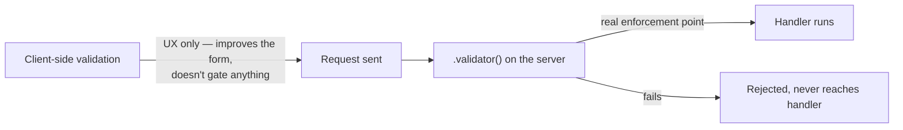

> **Verified against** `@tanstack/react-start` v1.168.x — July 2026.

Server functions look like plain async function calls, which makes it easy to forget they're HTTP endpoints. This chapter is the short list of things to get right before you ship one behind a login.

## CSRF: on by default, until you write `src/start.ts`

Start installs CSRF protection automatically via a request middleware, `createCsrfMiddleware()`. It checks that the request actually originated from your own site — using the standard same-origin signals a browser sends (`Sec-Fetch-Site`, falling back to `Origin`/`Referer` when that header isn't present) — and rejects the call otherwise.

🟢 This is stable, documented behavior — but it comes with a sharp edge:

:::caution
The automatic CSRF middleware only applies if you **haven't** created a `src/start.ts` file. The moment you add one — to register your own global middleware, for example — you take over the `requestMiddleware` list, and CSRF protection is no longer wired in for you. You have to add it back explicitly:
:::

```ts
// src/start.ts
import { createStart, createCsrfMiddleware } from '@tanstack/react-start'
import { loggingMiddleware } from './server/middleware/logging'

const csrfMiddleware = createCsrfMiddleware({
  filter: (ctx) => ctx.handlerType === 'serverFn',
})

export const startInstance = createStart(() => ({
  requestMiddleware: [csrfMiddleware, loggingMiddleware],
}))
```

If you already have a `src/start.ts` for other middleware and don't see `createCsrfMiddleware` in it, that's worth checking today, not after an incident.

## Never trust `sendContext` for authorization

[Part 3.3](../../03-server-functions-forms-security/03-middleware/) covered `next({ sendContext })` as the mechanism for passing data from a client-side middleware to the server side of the same call. It's just another piece of the request payload — a user can set it to whatever they want before the request leaves their browser.

```ts
// WRONG — trusting client-asserted identity
.client(({ next, context }) => next({ sendContext: { role: context.role } }))
.server(({ next, context }) => {
  if (context.role !== 'admin') throw new Error('Forbidden') // context.role is client-supplied
  return next()
})
```

```ts
// RIGHT — derive the session server-side, every time
.server(async ({ next, request }) => {
  const cookie = getRequestHeader('cookie')
  const session = await db.session.findFirst({ where: { token: parseCookie(cookie) } })
  if (!session) throw redirect({ to: '/login' })
  return next({ context: { session } }) // this context is server-computed, safe to branch on
})
```

The rule of thumb: anything that arrives via `sendContext`, a validator input, a header, or `FormData` is untrusted input, no different from a POST body. Anything your server middleware computed itself — a session looked up from a cookie against your own database — is the only thing safe to make an authorization decision on.

## Always validate on the server, not just the client

A schema on `.validator()` (Part 3.1) is your one real enforcement point — it runs on the server regardless of what the client sent. Client-side form validation (disabled submit buttons, inline error messages) is a UX layer, not a security boundary; nothing stops a request from being sent by hand with `fetch` or `curl`, bypassing the UI entirely.



If a route or feature has real business rules (a user can only see their own orders, a discount code has a usage limit), check them in the handler — or in middleware shared across the handlers that need the same check — not just in the schema shape.

## Server functions are same-origin RPC — not a public API

Server functions are designed to be called from your own app: a loader, a component, another server function. They're not meant to be a public HTTP API that other services or a mobile app hit directly.

If you need an endpoint that's callable **from outside your Start app** — a webhook receiver, a public REST endpoint, anything a third party or a different origin needs to call — use a **server route** instead (a plain HTTP handler defined via file-based routing's `server.handlers`, not a `createServerFn`). Server routes don't go through the RPC serialization/validator pipeline the same way, and you're responsible for whatever auth/CORS story a public endpoint needs.

| | Server function | Server route |
|---|---|---|
| Called from | Your app only (loaders, components, other server fns) | Anywhere — webhooks, other services, `curl` |
| Shape | RPC — typed input/output, Start handles serialization | Plain HTTP handler you write yourself |
| CSRF middleware | Applies (same-origin assumption) | You decide what applies |
| Use it for | Internal data fetching/mutation | Public APIs, webhooks, cross-origin calls |

## Checklist

- `src/start.ts` exists → confirm `createCsrfMiddleware()` is still in `requestMiddleware`.
- Every server function that touches user data has a `.validator()` schema, not a bare type annotation.
- Authorization checks read from server-derived `context` (session from cookie + DB), never from `sendContext` or any client-supplied field.
- Anything meant to be called from outside your app is a server route, not a server function.

Next: [3.5 — Forms](../../03-server-functions-forms-security/05-forms/) puts server-side validation to work in a real signup flow, including the case where JavaScript never loads.
