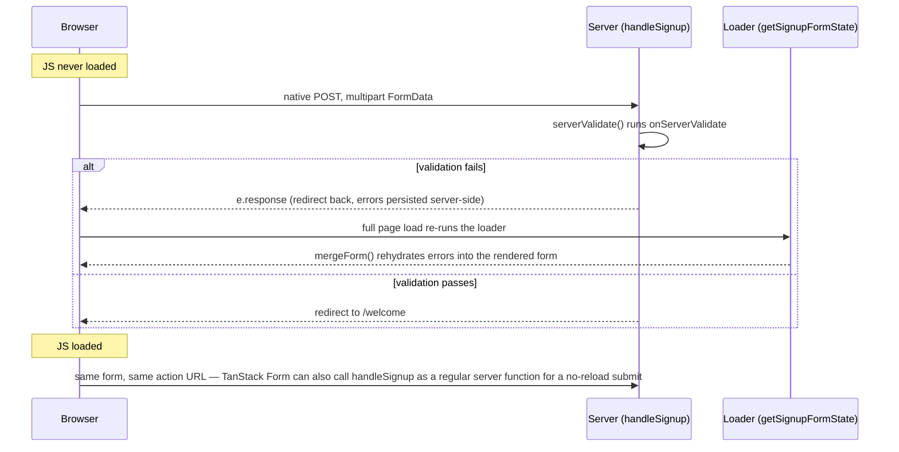

> **Verified against** `@tanstack/react-start` v1.168.x — July 2026. 🟢 `@tanstack/react-form-start` is part of TanStack Form's stable v1 line.

TanStack Form ships a dedicated Start integration as its own package: **`@tanstack/react-form-start`**. It's not a subpath of `@tanstack/react-form` — it's a separate install (`bun add @tanstack/react-form-start`, which depends on `@tanstack/react-form` for you), sitting alongside sibling packages for other frameworks (`@tanstack/react-form-nextjs`, `@tanstack/react-form-remix`). If a tutorial imports from `@tanstack/react-form/start`, that's an older/different path — for Start, use the dedicated package.

The idea this package exists to solve: define your form's shape **once**, and use that same definition to both initialize the client form and validate on the server — so client and server can never quietly drift out of sync.

## The shared bridge: `formOptions`

```ts
// src/routes/signup/-form-opts.ts
import { formOptions } from '@tanstack/react-form-start'

export const signupFormOpts = formOptions({
  defaultValues: {
    email: '',
    password: '',
    confirmPassword: '',
  },
})
```

This one object gets imported on both sides: the client component spreads it into `useForm`, the server validator spreads it into `createServerValidate`. Same shape, same defaults, one source of truth.

## Server-side validation

`createServerValidate` takes the shared `formOpts` plus an `onServerValidate` function, and gives you back a function that parses `FormData` and either returns the validated value or throws `ServerValidateError`:

```ts
// src/routes/signup/-server.ts
import { createServerFn } from '@tanstack/react-start'
import { createServerValidate, ServerValidateError, getFormData } from '@tanstack/react-form-start'
import { signupFormOpts } from './-form-opts'

const serverValidate = createServerValidate({
  ...signupFormOpts,
  onServerValidate: ({ value }) => {
    if (!value.email.includes('@')) {
      return 'Enter a valid email address'
    }
    if (value.password.length < 8) {
      return 'Password must be at least 8 characters'
    }
    if (value.password !== value.confirmPassword) {
      return 'Passwords do not match'
    }
  },
})

export const handleSignup = createServerFn({ method: 'POST' })
  .validator((data: unknown) => {
    if (!(data instanceof FormData)) throw new Error('Invalid form submission')
    return data
  })
  .handler(async ({ data }) => {
    try {
      const value = await serverValidate(data)
      await db.user.create({ data: { email: value.email, password: await hash(value.password) } })
    } catch (e) {
      if (e instanceof ServerValidateError) {
        // e.response carries the re-rendered form state (errors + submitted values) back to the client
        return e.response
      }
      throw e
    }
    throw redirect({ to: '/welcome' })
  })

// Used by the loader to rehydrate form state after a non-JS submission redirects back here
export const getSignupFormState = createServerFn({ method: 'GET' }).handler(async () => {
  return getFormData()
})
```

This is the same `.validator()` / `.handler()` shape from [Part 3.1](../../03-server-functions-forms-security/01-server-fn-anatomy/) — a form submission handler is just a `POST` server function whose validator happens to check for `FormData` instead of a JSON-shaped object.

:::note
`onServerValidate` is the enforcement point. Anything you check here runs regardless of what client-side validation did or didn't run — the same trust boundary covered in [Part 3.4](../../03-server-functions-forms-security/04-security-baseline/).
:::

## The route: native form, progressive enhancement

```tsx
// src/routes/signup/index.tsx
import { createFileRoute } from '@tanstack/react-router'
import { useForm, mergeForm, useTransform } from '@tanstack/react-form-start'
import { signupFormOpts } from './-form-opts'
import { handleSignup, getSignupFormState } from './-server'

export const Route = createFileRoute('/signup/')({
  loader: async () => ({ formState: await getSignupFormState() }),
  component: SignupPage,
})

function SignupPage() {
  const { formState } = Route.useLoaderData()

  const form = useForm({
    ...signupFormOpts,
    transform: useTransform((baseForm) => mergeForm(baseForm, formState), [formState]),
  })

  return (
    <form action={handleSignup.url} method="post" encType="multipart/form-data">
      <form.Field name="email">
        {(field) => (
          <label>
            Email
            <input
              name={field.name}
              value={field.state.value}
              onChange={(e) => field.handleChange(e.target.value)}
            />
            {field.state.meta.errors.map((err) => (
              <p key={err}>{err}</p>
            ))}
          </label>
        )}
      </form.Field>

      <form.Field name="password">
        {(field) => (
          <label>
            Password
            <input
              type="password"
              name={field.name}
              value={field.state.value}
              onChange={(e) => field.handleChange(e.target.value)}
            />
          </label>
        )}
      </form.Field>

      <form.Field name="confirmPassword">
        {(field) => (
          <label>
            Confirm password
            <input
              type="password"
              name={field.name}
              value={field.state.value}
              onChange={(e) => field.handleChange(e.target.value)}
            />
          </label>
        )}
      </form.Field>

      {form.state.errors.map((err) => (
        <p key={err}>{err}</p>
      ))}

      <button type="submit">Create account</button>
    </form>
  )
}
```

Trace what happens in each case:



The `<form action={handleSignup.url} method="post" encType="multipart/form-data">` is a **plain HTML form** — it works with zero JavaScript. The browser does a real POST, the server validates, and on failure `e.response` is a `Response` that gets the browser back to the form with its state preserved (read back out via `getFormData()`/`getSignupFormState` on the next load). `mergeForm()` combines that server-computed state with the client `useForm()` instance, so the errors show up in the exact fields the user needs to fix — no client-only revalidation logic duplicated by hand.

Once JavaScript is available, the same `handleSignup` reference is also a callable server function (per [Part 3.2](../../03-server-functions-forms-security/02-rpc-compile-boundary/)) — you can wire `form.handleSubmit` to call it directly and update `form` state without a full navigation, while keeping the exact same `onServerValidate` rules running underneath. The validation logic is never rewritten for the enhanced path; only the transport changes.

:::tip
This is the practical payoff of one shared `formOptions` object: there's exactly one place validation rules live (`onServerValidate`), and both the no-JS and JS-enabled paths run through it. You're not maintaining a client Zod schema and a server Zod schema that can drift.
:::
