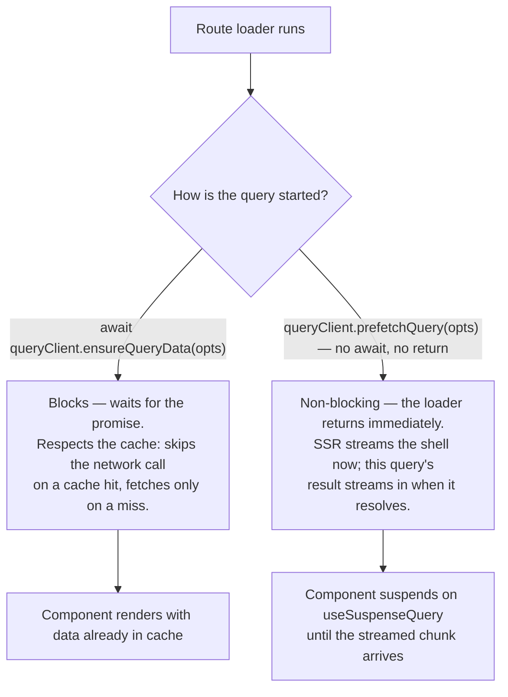
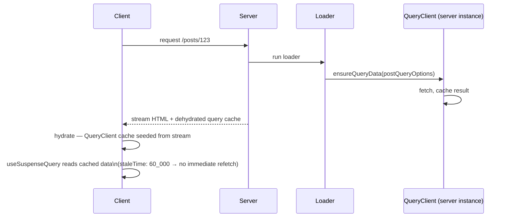

> **Verified against** `@tanstack/react-start` v1.168.x — July 2026. 🟢 This is the one officially supported state/data integration for Start — everything on this page is stable, documented behavior.

If you use one data-fetching library with Start, make it this one. Router owns navigation and preloading; Query owns caching, refetching, and invalidation. The integration package wires them together so SSR'd data flows into Query's cache automatically, with no manual hydration plumbing.

## Setup

```ts
// src/router.tsx
import { QueryClient } from '@tanstack/react-query'
import { createRouter } from '@tanstack/react-router'
import { setupRouterSsrQueryIntegration } from '@tanstack/react-router-ssr-query'
import { routeTree } from './routeTree.gen'

export const getRouter = () => {
  const queryClient = new QueryClient({
    defaultOptions: {
      queries: {
        staleTime: 60_000, // see "staleTime convention" below
      },
    },
  })

  const router = createRouter({
    routeTree,
    context: { queryClient }, // injected once, typed via createRootRouteWithContext
    defaultPreloadStaleTime: 0, // see below — stop Router's preload cache competing with Query's
  })

  setupRouterSsrQueryIntegration({ router, queryClient })

  return router
}
```

```ts
// src/routes/__root.tsx
import { createRootRouteWithContext } from '@tanstack/react-router'
import type { QueryClient } from '@tanstack/react-query'

export const Route = createRootRouteWithContext<{ queryClient: QueryClient }>()({
  component: RootLayout,
})
```

`setupRouterSsrQueryIntegration` is doing the real work: it hooks into the router's SSR lifecycle to dehydrate the query cache as part of the streamed response, and rehydrate it on the client before the first render — automatically, per navigation, including for queries started by non-blocking prefetches that resolve after the initial HTML has already streamed.

:::caution
If you find older blog posts or examples using `routerWithQueryClient` from `@tanstack/react-router-with-query`, that's the **previous** integration pattern. `setupRouterSsrQueryIntegration` from `@tanstack/react-router-ssr-query` is the current, supported one. They're not interchangeable — don't mix a tutorial's `routerWithQueryClient` setup with current API names.
:::

## Loaders: `ensureQueryData` vs. `prefetchQuery`

Both start a query from a loader. They differ in whether they block SSR:



```ts
// src/routes/posts.$postId.tsx
import { createFileRoute } from '@tanstack/react-router'
import { useSuspenseQuery, queryOptions } from '@tanstack/react-query'
import { fetchPost, fetchComments } from '../server/posts'

const postQueryOptions = (postId: string) =>
  queryOptions({
    queryKey: ['posts', postId],
    queryFn: () => fetchPost({ data: { postId } }),
  })

const commentsQueryOptions = (postId: string) =>
  queryOptions({
    queryKey: ['posts', postId, 'comments'],
    queryFn: () => fetchComments({ data: { postId } }),
  })

export const Route = createFileRoute('/posts/$postId')({
  loader: async ({ context: { queryClient }, params }) => {
    // blocking, preferred for anything the initial paint needs:
    // cache hit → resolves instantly, no network call. cache miss → fetches once.
    await queryClient.ensureQueryData(postQueryOptions(params.postId))

    // non-blocking — deliberately not awaited, not returned.
    // starts now, streams to the client whenever it resolves.
    queryClient.prefetchQuery(commentsQueryOptions(params.postId))
  },
  component: PostPage,
})

function PostPage() {
  const { postId } = Route.useParams()
  const { data: post } = useSuspenseQuery(postQueryOptions(postId))
  const { data: comments } = useSuspenseQuery(commentsQueryOptions(postId))
  return <Post post={post} comments={comments} />
}
```

Prefer `ensureQueryData` for anything the page's first paint genuinely needs — it respects the existing cache instead of unconditionally refetching (`fetchQuery` always fetches, even on a cache hit, which is rarely what you want in a loader). Reach for the non-blocking `prefetchQuery`/`fetchQuery` form — called without `await` or `return` — for data that can stream in after the shell, like comments below the fold.

## Read through the hook, not `useLoaderData`

This is the part people coming from a loader-centric mental model (Remix, or Start's own non-Query loaders) get wrong first:

```tsx
// WRONG for Query-backed data — bypasses the cache entirely
function PostPage() {
  const { post } = Route.useLoaderData()
  return <Post post={post} />
}
```

```tsx
// RIGHT — read through the same query the loader primed
function PostPage() {
  const { postId } = Route.useParams()
  const { data: post } = useSuspenseQuery(postQueryOptions(postId))
  return <Post post={post} />
}
```

`useLoaderData` gives you a static snapshot from whenever the loader ran. `useSuspenseQuery`/`useQuery` reads live from Query's cache — which means refetching, invalidation (`queryClient.invalidateQueries`), window-focus refetch, and garbage collection all keep working, because the component is registered as an active observer of that query. If you only ever read via `useLoaderData`, Query has no component subscribed to the data, so `invalidateQueries` has nothing to notify and stale data just sits there until the next navigation re-runs the loader.

The loader's job is to make sure the data is *already in the cache* by the time the component renders (so there's no client-side waterfall) — not to be the thing the component actually reads from.

## No manual hydration boundary

If you've used TanStack Query with Next.js's App Router, you're used to wrapping trees in `<HydrationBoundary state={dehydrate(queryClient)}>` by hand. Start doesn't need that — `setupRouterSsrQueryIntegration` handles dehydration, streaming, and rehydration as part of the router's own SSR lifecycle. You call `ensureQueryData`/`prefetchQuery` in a loader and read via the hooks; the wiring in between is the integration's job, not yours.

## The `staleTime` convention

Two related settings, easy to get backwards:

- **`defaultPreloadStaleTime: 0`** on `createRouter(...)` — this is the Router's *own* preload cache (used when you hover a `<Link>` and Router speculatively runs the loader). Setting it to `0` stops Router's preload cache from serving stale data that competes with Query's cache — Query becomes the single source of truth for "is this data fresh."
- **Query's `staleTime`** (in `QueryClient`'s `defaultOptions.queries`, or per-query) — set this **above** `0`, e.g. `60_000`. This is what actually matters for the SSR handoff: without it, the moment the client hydrates, Query considers the just-streamed data instantly stale and refetches it on mount — defeating the point of having server-rendered it in the first place.



Get this pair backwards — `defaultPreloadStaleTime` left at its non-zero default, Query's `staleTime` left at `0` — and you'll see either duplicate fetches racing each other, or an immediate client refetch right after every SSR'd page loads.

Next: [4.2 — TanStack DB](../../04-state-and-data/02-tanstack-db/) covers what to reach for when Query's request/response model isn't enough — reactive, relational client-side state.
