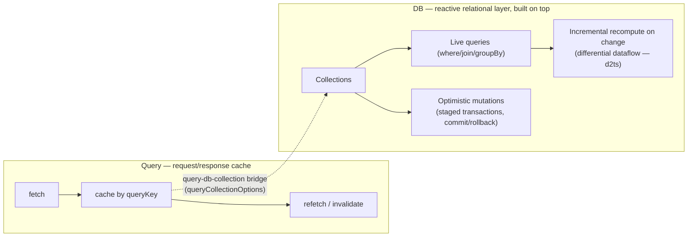

> **Verified against** `@tanstack/react-start` v1.168.x — July 2026. `@tanstack/db` v0.6.x, `@tanstack/react-db` v0.1.x.

:::danger
🟡 **Beta, and no SSR support today.** `@tanstack/db` is pre-1.0 (v0.6.x core, v0.1.x React bindings) and its docs describe it as evolving quickly. There is no supported way to hydrate a DB collection from server-rendered state the way Query does — the maintainers have said publicly they're looking for early partners to help design that. In a Start app right now, TanStack DB is **client-only**: collections start empty and populate after the browser mounts, same as any client-side data layer with no SSR story. Don't build a page's first paint around it. Verify current SSR status before relying on this in production — this is exactly the kind of thing that could change chapter to chapter.
:::

## What problem it solves that Query doesn't

TanStack Query gives you request/response caching — fetch, cache, refetch, invalidate. TanStack DB sits on top of that (or another sync source) and adds a **reactive, relational layer**: typed collections you can query with `where`/`join`/`groupBy` like a local database, where the results update incrementally as the underlying data changes, and where mutations are staged as transactions you can commit or roll back.



## Collections and live queries

A collection is a typed set of objects. A live query reads from one or more collections and stays up to date as they change — no manual `useEffect` refetch, no re-running the whole query by hand:

```tsx
import { useLiveQuery } from '@tanstack/react-db'
import { eq } from '@tanstack/db'
import { todosCollection } from './collections'

function ActiveTodos() {
  const { data } = useLiveQuery((q) =>
    q
      .from({ todo: todosCollection })
      .where(({ todo }) => eq(todo.completed, false))
      .orderBy(({ todo }) => todo.createdAt, 'desc'),
  )

  return <ul>{data?.map((todo) => <li key={todo.id}>{todo.text}</li>)}</ul>
}
```

The query builder doesn't run the pipeline in the order you wrote it — it compiles the whole chain (`from`/`where`/`join`/`groupBy`/`orderBy`) into an incremental pipeline built on **differential dataflow** (the `d2ts` library). When one row changes, the engine recomputes only what that change affects, not the whole result set. That's the practical reason DB queries stay fast on large client-side datasets where re-running a full filter/sort/join on every change would visibly lag.

## Optimistic mutations: staged transactions

Writes go through the collection and are applied to local state immediately (optimistically), then persisted through a handler you define. If the handler throws, the optimistic change rolls back automatically:

```ts
const todosCollection = createCollection({
  id: 'todos',
  onInsert: async ({ transaction }) => {
    await Promise.all(
      transaction.mutations.map((m) => api.todos.create(m.modified)),
    )
    // must not resolve until the server change has synced back to the collection
  },
})

// optimistic — UI updates now, rolls back if onInsert throws
todosCollection.insert({ id: crypto.randomUUID(), text: 'Ship the chapter', completed: false })
```

For a mutation that spans multiple collections or needs explicit user-driven commit/rollback (a multi-step wizard, a "review before saving" flow), use `createOptimisticAction` or a manual `createTransaction`:

```ts
import { createTransaction } from '@tanstack/react-db'

const tx = createTransaction({
  autoCommit: false,
  mutationFn: async ({ transaction }) => api.saveTodo(transaction.mutations),
})

tx.mutate(() => todosCollection.insert({ id: '1', text: 'First', completed: false }))
tx.mutate(() => todosCollection.insert({ id: '2', text: 'Second', completed: false }))

// only persisted once the caller decides to commit
await tx.commit()
// or: tx.rollback()
```

This staged-transaction shape is the same primitive [Part 6.4 (ERP pattern)](../../06-patterns/04-erp-pattern/) reaches for when a single business operation touches several records and needs all-or-nothing semantics.

## The Query bridge: `queryCollectionOptions`

You don't have to pick DB *or* Query — the `@tanstack/query-db-collection` package backs a DB collection with a TanStack Query, so Query stays your fetch/cache layer and DB adds live queries and optimistic writes on top:

```ts
import { QueryClient } from '@tanstack/query-core'
import { createCollection } from '@tanstack/db'
import { queryCollectionOptions } from '@tanstack/query-db-collection'

const queryClient = new QueryClient()

const todosCollection = createCollection(
  queryCollectionOptions({
    queryKey: ['todos'],
    queryFn: async () => (await fetch('/api/todos')).json(),
    queryClient,
    getKey: (item) => item.id,
    refetchOnWindowFocus: true,
  }),
)
```

This is the most common way to adopt DB inside a Start app today: keep Query doing SSR-friendly fetching per [Part 4.1](../../04-state-and-data/01-tanstack-query/) for anything that needs to render on the first paint, and layer a DB collection on top — client-side, post-hydration — for the pieces that benefit from live queries or optimistic staged writes.

## Sync backends

Beyond the Query bridge, DB ships collection types for syncing directly from a backend:

| Collection | Backs onto | Consistency |
|---|---|---|
| `QueryCollection` | Any REST API, via TanStack Query polling | Whatever your `refetchInterval`/`staleTime` says |
| `ElectricCollection` | Postgres, via [ElectricSQL](https://electric-sql.com) "shapes" over HTTP long-polling | ~1–2 seconds, transaction-id matched |
| `TrailBaseCollection` | [TrailBase](https://trailbase.io) (self-hosted backend with subscriptions) | Backend-dependent |
| `RxDBCollection` | [RxDB](https://rxdb.info) (offline-first, replicated) | Replication-dependent |
| `PowerSyncCollection` | [PowerSync](https://www.powersync.com) (SQLite-based offline sync) | Sync-cycle-dependent |

`ElectricCollection` is the one worth calling out specifically, since it's the most commonly reached-for real-time-ish option:

```ts
import { createCollection } from '@tanstack/db'
import { electricCollectionOptions } from '@tanstack/electric-db-collection'

const todosCollection = createCollection(
  electricCollectionOptions({
    shapeOptions: { url: '/api/todos' }, // proxied to Electric's shape endpoint
    getKey: (item) => item.id,
    onInsert: async ({ transaction }) => {
      const response = await api.todos.create(transaction.mutations[0].modified)
      return { txid: response.txid } // Electric confirms sync by matching this txid
    },
  }),
)
```

:::caution
Electric syncs Postgres changes to the client over HTTP long-polling, confirming a write has synced back by matching a transaction ID — in practice that lands in roughly one to two seconds, not milliseconds. That's genuinely useful for order/position data, inventory counts, or a collaborative document's row-level state — data where "current within a couple seconds" is fine. It is **not** built for tick-by-tick prices or anything that needs sub-second delivery. [Part 6.3](../../06-patterns/03-trading-realtime-pattern/) covers what to use instead for that case.
:::

Next: [4.3 — Decision framework](../../04-state-and-data/03-decision-framework/) covers when you'd actually reach for DB (or a client store) instead of just Query.
