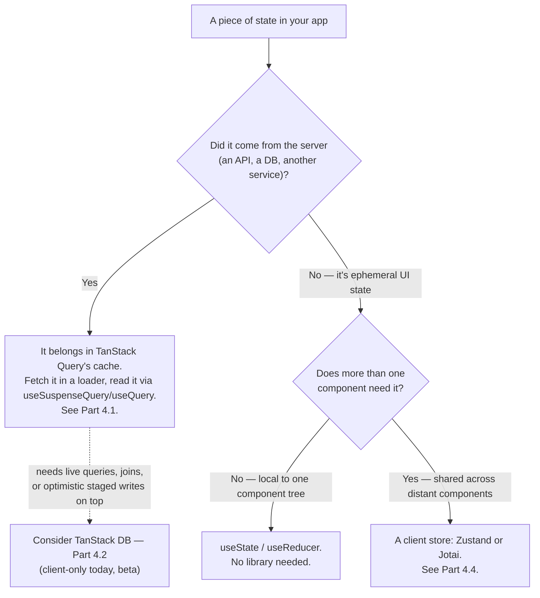

> **Verified against** `@tanstack/react-start` v1.168.x — July 2026.

The most common state-management mistake in a Start app isn't picking the wrong library — it's reaching for one before checking whether the data is even client state to begin with.

## The one question that matters

**Where did this piece of state come from?**



## Server-fetched data goes in Query, not a client store

If data came from `fetch`, a server function, or a database — anything the server told you — it belongs in TanStack Query's cache, fetched through a loader and read through `useSuspenseQuery`/`useQuery` as covered in [Part 4.1](../../04-state-and-data/01-tanstack-query/). Putting that same data into a Zustand store or a Jotai atom "just to have it globally available" is an anti-pattern in a Start app specifically, for reasons that are Start-shaped, not generic:

- You lose the automatic dehydration/hydration Query's SSR integration gives you for free — you'd have to hand-roll serializing that data into the client store yourself.
- You lose cache semantics: `staleTime`, background refetch, `invalidateQueries` — a plain store doesn't know when its data is stale or how to refresh it.
- You lose request deduplication — two components independently reading "the current user" from a store each have to know who's responsible for fetching it and when; Query's `queryKey` already handles this.
- You risk the state-leak bug class covered in [Part 4.5](../../04-state-and-data/05-singleton-leak-bug-class/) if that store is created at module scope instead of per request.

If you're duplicating server data into a store so a component *not* directly under the loader's route can read it, that's a sign you want `useSuspenseQuery(sameQueryOptions)` in that component instead — Query's cache is already global to the app; you don't need a second global to make data available in a distant component.

```ts
// WRONG — server data copied into a client store "for global access"
const useUserStore = create<{ user: User | null; setUser: (u: User) => void }>((set) => ({
  user: null,
  setUser: (user) => set({ user }),
}))

function ProfileMenu() {
  // this component has no idea when `user` goes stale, or how to refetch it
  const user = useUserStore((s) => s.user)
  return <span>{user?.name}</span>
}
```

```ts
// RIGHT — read the same query anywhere it's needed; Query's cache is already global
const userQueryOptions = () => queryOptions({ queryKey: ['user'], queryFn: fetchCurrentUser })

function ProfileMenu() {
  const { data: user } = useSuspenseQuery(userQueryOptions())
  return <span>{user.name}</span>
}
```

Both components above can sit anywhere in the tree — neither needs to be a descendant of the route that first fetched the user. `queryKey` is the shared identity; Query dedupes the fetch instead of your having to route a store update through the right places.

## When a client store earns its place

A client store is for state that is genuinely local to the browser session and never round-trips to a server: is a modal open, which step of a wizard the user is on, the current filter/sort selection in a table's UI (as opposed to the data the filter fetched), whether the sidebar is collapsed, the active tab, a theme preference before it's persisted. None of that has a server-side source of truth to stay in sync with — it's not "data," it's interaction state.

A reasonable rule of thumb: if losing this state on a hard refresh would be mildly annoying but not wrong, it's UI state — a client store or even `useState` further up the tree is fine. If losing it on refresh would show the user stale or incorrect information, it's server data, and belongs in Query.

## Where TanStack DB fits

DB (Part 4.2) isn't a third bucket alongside "server data" and "UI state" — it's an optional reactive layer *on top of* server data, for when Query's request/response model isn't expressive enough: you need live-updating joins across collections, or optimistic writes staged as transactions you can roll back. Reach for it when you outgrow what `useQuery` + local `useState` can comfortably do, not as a default. And remember its current constraint: client-only, no SSR — so anything DB manages won't be part of the server-rendered first paint.

Next: [4.4 — Zustand vs. Jotai](../../04-state-and-data/04-zustand-vs-jotai/) covers the two client-store options for the "genuinely local UI state" branch above.
