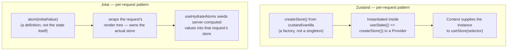

> **Verified against** `@tanstack/react-start` v1.168.x — July 2026.

:::caution
🔴 **Community-inferred.** Neither Zustand nor Jotai publishes Start-specific SSR guidance. Everything in this chapter is adapted from each library's official **Next.js** SSR guide, applied to Start's per-request model — the underlying problem (module-level state leaking across requests on a server) is the same regardless of framework, but nobody upstream has committed to these exact patterns for Start. Verify against current docs before treating this as settled.
:::

This chapter assumes you've already read [4.3](../../04-state-and-data/03-decision-framework/) and concluded you need a client store for genuinely local UI state — not server data, which belongs in Query.



## Zustand: vanilla store + Context, never the global `create()`

The idiom most Zustand tutorials show — `export const useStore = create(() => ({...}))` at module scope — is an SSR footgun (see [Part 4.5](../../04-state-and-data/05-singleton-leak-bug-class/) for why). The safe pattern is `createStore` from `zustand/vanilla`, instantiated once per request inside a Context Provider:

```ts
// store.ts
import { createStore } from 'zustand/vanilla'

type SidebarState = {
  isOpen: boolean
  toggle: () => void
}

const defaultInitState: Pick<SidebarState, 'isOpen'> = { isOpen: false }

export const createSidebarStore = (initState = defaultInitState) =>
  createStore<SidebarState>()((set) => ({
    ...initState,
    toggle: () => set((state) => ({ isOpen: !state.isOpen })),
  }))

export type SidebarStoreApi = ReturnType<typeof createSidebarStore>
```

```tsx
// store-provider.tsx
import { createContext, useContext, useState, type ReactNode } from 'react'
import { useStore } from 'zustand'
import { createSidebarStore, type SidebarStoreApi } from './store'

const SidebarStoreContext = createContext<SidebarStoreApi | undefined>(undefined)

export const SidebarStoreProvider = ({ children }: { children: ReactNode }) => {
  // useState's initializer runs once per component instance —
  // once per request on the server, once for the app's lifetime on the client
  const [store] = useState(() => createSidebarStore())
  return <SidebarStoreContext.Provider value={store}>{children}</SidebarStoreContext.Provider>
}

export const useSidebarStore = <T,>(selector: (state: SidebarState) => T): T => {
  const store = useContext(SidebarStoreContext)
  if (!store) throw new Error('useSidebarStore must be used within SidebarStoreProvider')
  return useStore(store, selector)
}
```

Mount `SidebarStoreProvider` in your root route component. The `useState(() => createSidebarStore())` call is what gives you per-request isolation on the server — each request renders the tree fresh, so each gets its own store instance, instantiated exactly once for that render.

Zustand's own docs state the constraint plainly: the store "should not be shared across requests. Instead, the store should be created per request." A module-level `const store = createStore(...)` violates that on any server that reuses a JS isolate across requests — which is most of them.

## Jotai: `<Provider>` per request, `useHydrateAtoms` for seeding

Jotai's default mode is provider-less — atoms read/write against an implicit global store. Jotai's own docs call this out directly as an SSR risk: without an explicit `<Provider>`, "this global store is kept alive and is shared between multiple requests, which can lead to bugs and security risks." So the first requirement is the same shape as Zustand's: scope the store to the request.

```tsx
// root layout
import { Provider } from 'jotai'

function RootLayout({ children }: { children: React.ReactNode }) {
  return <Provider>{children}</Provider>
}
```

Each render of `RootLayout` — once per request on the server — creates a fresh Jotai store scoped to that `<Provider>`. Atoms defined at module scope (`export const sidebarOpenAtom = atom(false)`) are safe here specifically *because* they're just keys/definitions; the actual state lives in whichever `<Provider>` store is in context, not on the atom object itself.

To seed a client atom from data you already fetched on the server (a loader result, say), use `useHydrateAtoms`:

```tsx
import { useHydrateAtoms } from 'jotai/utils'
import { currentThemeAtom } from './atoms'

function ThemeHydrator({ initialTheme, children }: { initialTheme: string; children: React.ReactNode }) {
  useHydrateAtoms([[currentThemeAtom, initialTheme]])
  return children
}
```

:::note
You can't return a promise from an atom during SSR — Jotai's SSR guidance is explicit that this isn't supported. If an atom's value needs async data, resolve it (in a loader, ahead of render) and hydrate the resolved value in with `useHydrateAtoms`, rather than making the atom itself async for the SSR pass.
:::

## The Query bridge: Jotai has one, Zustand doesn't

This is the one point that isn't symmetric. `jotai-tanstack-query` is a maintained, official-adjacent package (published under the `jotaijs` org) that gives you `atomWithQuery`/`atomWithMutation` — Query-backed atoms that share the same `QueryClient` your router's SSR integration uses:

```ts
import { atomWithQuery } from 'jotai-tanstack-query'

const todosAtom = atomWithQuery(() => ({
  queryKey: ['todos'],
  queryFn: fetchTodos,
}))
```

```tsx
import { queryClientAtom } from 'jotai-tanstack-query'
import { useHydrateAtoms } from 'jotai/react/utils'

function HydrateQueryClient({ queryClient, children }: { queryClient: QueryClient; children: React.ReactNode }) {
  useHydrateAtoms([[queryClientAtom, queryClient]])
  return children
}
```

This is mostly relevant if you're already committed to Jotai for UI state and want atom-shaped access to Query data too, rather than calling `useSuspenseQuery` directly. It doesn't replace [Part 4.1](../../04-state-and-data/01-tanstack-query/)'s Query integration — `queryClientAtom` still needs to point at the *same* `QueryClient` instance the router's SSR integration set up. Zustand has no equivalent first-party bridge; if you're on Zustand and want Query-backed data, you call `useQuery` directly in the component, same as you would without Zustand at all.

## Side by side

| | Zustand | Jotai |
|---|---|---|
| Per-request pattern | `createStore` (vanilla) + Context + `useState` | `<Provider>` wrapping the request's render tree |
| Mental model | One store object, selector functions | Fine-grained atoms, composed by reference |
| Official Start docs | None (Next.js guide only) | None (Next.js guide only) |
| Server → client seeding | Pass `initState` into `createXStore(initState)` on both sides | `useHydrateAtoms([[atom, value]])` |
| Query bridge | None — call `useQuery` directly | `jotai-tanstack-query` (`atomWithQuery`, shares `queryClientAtom`) |
| Biggest footgun | Global `create()` instead of vanilla store + Context | Skipping `<Provider>`, relying on the implicit global store |

## Recommendation

For a new Start app, **Jotai edges ahead** — it has an official Query bridge, a purpose-built hydration primitive (`useHydrateAtoms`), and its per-request pattern (`<Provider>`) is a single wrapper rather than a store-factory-plus-context you write by hand. There are also fewer ways to accidentally recreate the global-singleton footgun: Jotai's docs call the provider-less default out explicitly, whereas Zustand's naive `create()` idiom *looks* correct and only fails under concurrent requests.

That said, Zustand is fully viable with the discipline shown above, and it wins if your team wants one store with a couple of actions rather than a scattered set of atoms — the vanilla-store-per-request pattern isn't hard, it's just something you have to remember to do, every time, rather than something the library defaults you into.

Whichever you pick, the underlying risk is the same bug class — covered next.

Next: [4.5 — The singleton-leak bug class](../../04-state-and-data/05-singleton-leak-bug-class/) explains exactly why module-level stores are dangerous on a server, with or without a framework in the middle.
