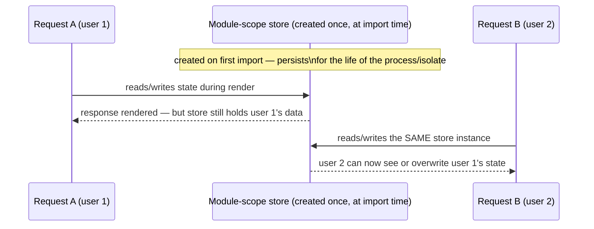
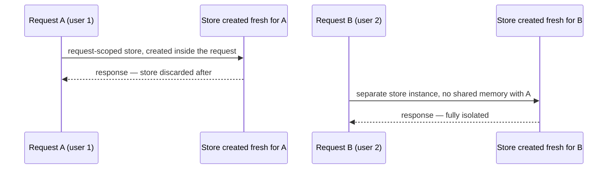

> **Verified against** `@tanstack/react-start` v1.168.x — July 2026.

This is the one bug class you need to understand before writing any stateful container in a Start app — a `QueryClient`, a Zustand store, a Jotai store, or anything else. It's not specific to any one library; it's a property of how servers execute your code.

## The core bug

```ts
// module scope — evaluated ONCE when this file is first imported
const store = createStore(...)
```

On the client, "once" means once per page load — one browser tab, one user, no problem. On a server, "once" means **once for the lifetime of the JS process** — which might be handling requests from hundreds of different users, sequentially or concurrently, over that process's entire lifetime.





The fix isn't "be careful" — it's structural: never let a stateful container be created at module scope. Create it inside something that runs per request (a request handler, a component's `useState` initializer during a fresh render, Start's router context) and let it be discarded when that request ends.

## This isn't unique to long-lived servers

It's tempting to think this only matters for a traditional always-on Node server handling many users at once. It's just as real on serverless/edge, for a different reason: **warm isolates**. A serverless platform frequently reuses the same running process for the *next* request that comes in shortly after, to avoid cold-start latency. If your module-level singleton survived the first request, it's still sitting in memory when the second, unrelated request's code runs in that same warm isolate — even though the requests are for two completely different users, possibly seconds apart.

"Serverless" doesn't mean "a fresh process every time." It means you don't control *when* a process is reused — which makes the module-scope mistake harder to notice in testing (a single local dev request per process looks fine) and more consequential in production (warm isolates are the normal case under real traffic, not an edge case).

## What the libraries themselves warn about

This isn't a hypothetical the framework authors overlooked — it's called out directly in each library's own docs:

- **TanStack Query**: a `QueryClient` created at file/module scope and shared across requests "leaks any sensitive data" between users — because the cache holds actual fetched data (a user's profile, their orders), not just query metadata.
- **Jotai**: the implicit global store (what you get without an explicit `<Provider>`) is documented as leading to "bugs and security risks" specifically in an SSR context, because it's shared between requests by default.
- **Zustand**: the docs state plainly that a store "should not be shared across requests" and should be created per request instead.

Three different libraries, three different APIs, the same underlying warning — because it's the same underlying mechanism.

## Why streaming makes it worse

Start's whole value proposition includes streaming SSR ([Part 2.1](../../02-rendering-model/01-ssr-and-streaming/)) — the server can start sending HTML before every piece of data has resolved, and fill in the rest as it streams. That's great for time-to-first-byte, but it stretches out the window during which a single request's render is "in flight" on the server.

A longer in-flight window means more opportunity for two requests to be mid-render *at the same time*, both touching whatever module-level state exists — a blocking, non-streamed response finishes fast and narrows that overlap window; a streamed response can stay open for as long as its slowest deferred chunk takes to resolve. If that shared state is a singleton `QueryClient` or store, request A's in-flight streamed render and request B's concurrent render can genuinely interleave their reads/writes on the same object, not just "eventually" clobber each other between separate requests.

## The mitigation

Create every stateful container fresh, per request:

- **`QueryClient`** — created inside your router factory function (see [Part 4.1](../../04-state-and-data/01-tanstack-query/)'s `getRouter()`), which itself needs to be called once per request/render, not once at module scope. Hang the instance off Start's router context.
- **Zustand store** — `createStore` from `zustand/vanilla`, instantiated inside a `useState(() => createStore(...))` initializer in a Provider component, so it's created fresh each time that component renders (once per request on the server) — the exact pattern in [Part 4.4](../../04-state-and-data/04-zustand-vs-jotai/).
- **Jotai store** — an explicit `<Provider>` wrapping the request's render tree, instead of relying on the implicit global store.

The common shape: **nothing stateful lives at module scope.** Module scope is fine for pure definitions — a Zustand store *factory* function, a Jotai atom *definition*, a Query `queryOptions` helper — because those don't hold any actual data themselves, they just describe how to create or reference it. The data itself always gets created inside something request-scoped.

:::tip
A fast sanity check for any file: search it for `create(`, `createStore(`, `new QueryClient(`, or `atom(...)` used to hold live data (not just a definition) sitting directly at the top level, outside any function. If you find one backing real state, ask where it's instantiated from — if the answer is "when this module is first imported," that's the bug.
:::
