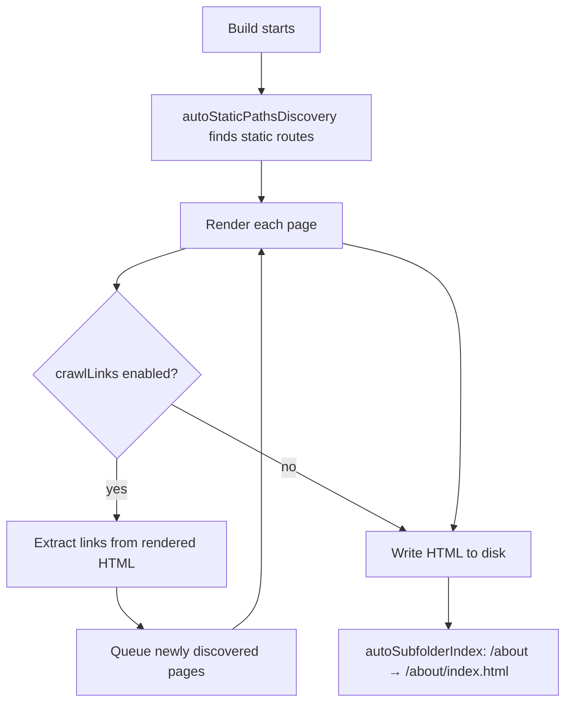
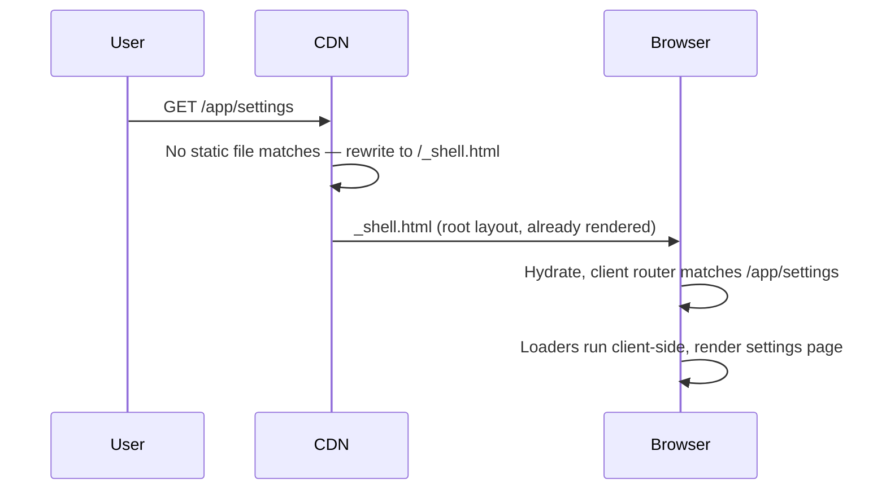

> **Verified against** `@tanstack/react-start` v1.168.x — July 2026.

## Two different problems, one config block

"Make this static" and "make this a pure client app" sound similar but solve different problems. Prerendering turns specific routes into HTML files at build time — the rest of your app can still be server-rendered per request. SPA mode turns the *entire* app into a single static shell with no server-rendered routes at all. Both are configured under the same `tanstackStart({ prerender, spa })` block, and SPA mode is actually implemented as a prerender job with different defaults — so it's worth learning prerendering first.

## Static prerendering

Enable it in `vite.config.ts`:

```ts
// vite.config.ts
import { defineConfig } from 'vite'
import { tanstackStart } from '@tanstack/react-start/plugin/vite'
import viteReact from '@vitejs/plugin-react'

export default defineConfig({
  plugins: [
    tanstackStart({
      prerender: {
        enabled: true,
        crawlLinks: true,
        autoStaticPathsDiscovery: true,
        autoSubfolderIndex: true,
        concurrency: 14,
        retryCount: 2,
        retryDelay: 1000,
        maxRedirects: 5,
        failOnError: true,
      },
    }),
    viteReact(),
  ],
})
```

Every key here has a default — this example just spells them out:

| Key | Default | What it does |
|---|---|---|
| `enabled` | `false` | Turns prerendering on for the build. |
| `crawlLinks` | `true` | After rendering a page, extracts its `<a href>` links and prerenders those pages too. Your home page links to `/posts`? `/posts` gets prerendered without you listing it anywhere. |
| `autoStaticPathsDiscovery` | `true` | Discovers static routes from your route tree automatically. Parameterized routes (`/posts/$slug`), layout routes (`_layout`), and API routes are excluded from auto-discovery — a dynamic route still gets prerendered if `crawlLinks` finds a link to a concrete instance of it. |
| `autoSubfolderIndex` | `true` | Writes `/about` as `/about/index.html` instead of `/about.html`, matching how most static hosts and CDNs resolve clean URLs. |
| `concurrency` | `14` | How many pages render in parallel during the build. |
| `retryCount` / `retryDelay` | `2` / `1000` | Retries a failed page render this many times, waiting this many milliseconds between attempts, before giving up on it. |
| `maxRedirects` | `5` | Caps redirect chains the crawler will follow before treating it as an error. |
| `filter` | — | A function `(page) => boolean` to exclude pages from discovery — useful for keeping admin or draft routes out of a public build. |
| `failOnError` | `true` | A single page failing to prerender fails the whole build. Set `false` if you'd rather ship a partial build and fix the broken page later. |
| `onSuccess` | — | Callback invoked after a successful render — a hook for logging or post-processing output files. |



### Per-route control: the `pages` array

Auto-discovery and crawling cover most sites, but sometimes you need to force a route in (or out), or point its output somewhere non-standard. That's what `pages` is for:

```ts
tanstackStart({
  prerender: { enabled: true, crawlLinks: true },
  pages: [
    { path: '/pricing', prerender: { enabled: true, outputPath: '/pricing/index.html' } },
    { path: '/admin', prerender: { enabled: false } },
  ],
})
```

Each entry is `{ path, prerender: { enabled, outputPath } }`. This is also where you deal with the sitemap's rough edges — see below.

### The built-in sitemap

A sibling `sitemap` key (not nested under `prerender`) generates `sitemap.xml` from whatever got prerendered:

```ts
tanstackStart({
  prerender: { enabled: true, crawlLinks: true },
  sitemap: {
    enabled: true,
    host: 'https://example.com',
  },
})
```

:::caution
The built-in sitemap lists every prerendered URL and nothing more — as of this writing there's no per-page `priority` or `changefreq` control, and no `lastmod`. It also has a known duplicate-entry bug for index routes: `/posts` and `/posts/` can both end up in the sitemap ([tanstack/router#6978](https://github.com/TanStack/router/issues/6978)). Exclude the duplicate with `sitemap: { exclude: true }` on the offending `pages` entry:

```ts
pages: [{ path: '/posts/', sitemap: { exclude: true } }]
```

If you need `priority`, `changefreq`, or `lastmod`, don't fight the generator — turn it off (`sitemap: { enabled: false }`) and serve `/sitemap.xml` yourself from a server route that reads your actual content dates. That route can itself be prerendered via the same `pages` array.
:::

## SPA mode

SPA mode is for apps that don't want server rendering at all — an internal tool behind a login, for example, where SEO doesn't matter and every page needs the same client-side bootstrap. Instead of prerendering N pages, it prerenders exactly one: a shell.

```ts
tanstackStart({
  spa: {
    enabled: true,
  },
})
```

The build renders your root route (and any `beforeLoad`/loader data on it) once, using the SSR build, and writes the result to `/_shell.html`. Every other route is left unrendered — the client router takes over after hydration and resolves them entirely in the browser. Your host rewrites unmatched paths to `/_shell.html` (a standard CDN "SPA fallback" rule), so deep links still load the shell and the router then navigates client-side to the right route.



Because the shell is just a prerender job under the hood, its defaults are tuned for a single-page render rather than a crawl: `crawlLinks: false` (there's nothing to crawl — you want one file, not your whole site) and `retryCount: 0` (no retry loop for a build that's supposed to produce exactly one output). You can override both:

```ts
tanstackStart({
  spa: {
    enabled: true,
    prerender: {
      outputPath: '/_shell.html', // default
      crawlLinks: false,          // default
      retryCount: 0,              // default
    },
  },
})
```

There's also `spa.maskPath` (default `/`) — the pathname the shell is rendered *as* when your root loaders run, in case your root route behaves differently depending on path.

:::note
SPA mode and per-route prerendering solve different problems and you don't have to pick one globally. A marketing site can prerender its content pages while a `/app/*` subtree runs as an SPA shell — set `pages` entries with `prerender: { enabled: false }` for the app routes and let `spa` handle bootstrapping them. If you're mixing SSR routes with a client-only region *within* the same page rather than the whole app, that's the [shell pattern](../../06-patterns/01-shell-pattern/), not SPA mode — SPA mode has no server-rendered routes at all.
:::
