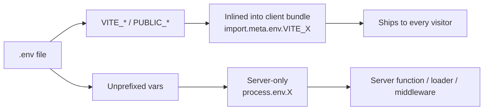
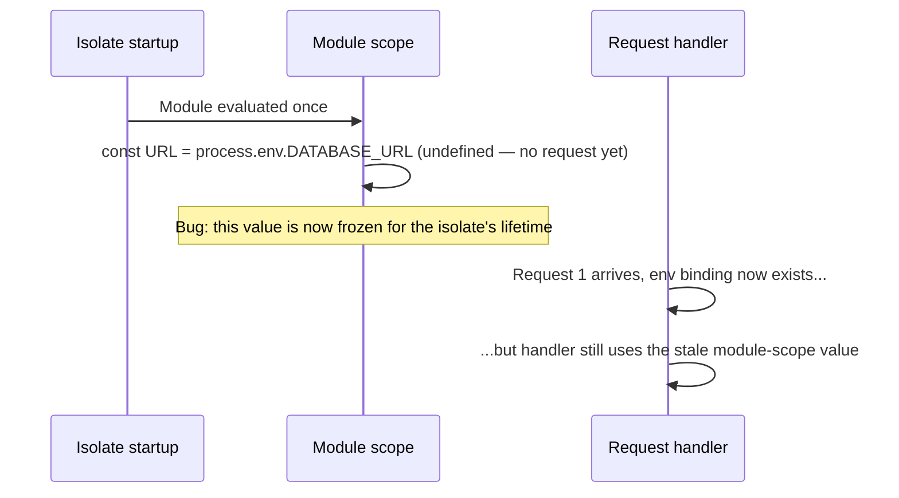

> **Verified against** `@tanstack/react-start` v1.168.x — July 2026.

## Caching headers

Start doesn't invent its own caching layer — you set standard HTTP headers, and any CDN or browser in front of your app respects them the normal way. From inside a server function or a server route handler, use `setResponseHeaders`:

```ts
import { createServerFn } from '@tanstack/react-start'
import { setResponseHeaders } from '@tanstack/react-start/server'

export const getProductList = createServerFn({ method: 'GET' }).handler(async () => {
  setResponseHeaders(
    new Headers({
      'Cache-Control': 'public, max-age=300',
    }),
  )
  return db.product.findMany()
})
```

Two shapes come up constantly:

```ts
// Public, cacheable data — safe to share across users and CDN edges
setResponseHeaders(
  new Headers({
    'Cache-Control': 'public, max-age=300',
    'CDN-Cache-Control': 'max-age=3600, stale-while-revalidate=600',
  }),
)

// Per-user data — cacheable in the browser only, never shared, and must
// vary by whatever identifies the user
setResponseHeaders(
  new Headers({
    'Cache-Control': 'private, max-age=60',
    Vary: 'Cookie, Authorization',
  }),
)
```

`CDN-Cache-Control` (and the equivalent `s-maxage`) lets you give the CDN a longer cache window than the browser gets — the browser revalidates more often, the edge holds on longer and absorbs most of the traffic. `Vary: Cookie, Authorization` is the detail people forget: without it, a CDN or shared cache can serve user A's private response to user B, because from the cache's point of view the URL was identical.

For the full time-based-plus-on-demand caching story — background revalidation, purge webhooks — see the [ISR chapter](../04-isr/); it's the same `Cache-Control` mechanism with a regeneration step layered on top, and it comes with its own stability caveat.

## Environment variables

Start doesn't add a proprietary env system. It uses whatever your build tool already does, plus one rule about *where* client code is allowed to read from.

**Server code** — server functions, loaders, middleware — reads any variable via `process.env`, prefixed or not:

```ts
const getOrder = createServerFn({ method: 'GET' }).handler(async () => {
  const db = await connect(process.env.DATABASE_URL) // fine — never reaches the client
  return db.order.findFirst()
})
```

**Client code** can only read variables that were exposed at build time under a specific prefix, through `import.meta.env`:

- Vite (Start's default): `VITE_` prefix.
- Rsbuild: `PUBLIC_` prefix.

```tsx
export function AppHeader() {
  return <h1>{import.meta.env.VITE_APP_NAME}</h1>
}
```

Anything without the prefix simply isn't in the client bundle — `import.meta.env.DATABASE_URL` is `undefined` on the client, by design. The inverse mistake is the dangerous one: naming a secret `VITE_DATABASE_URL` gets it inlined into the JavaScript bundle you ship to every visitor's browser. The prefix is an exposure switch, not a naming convention — never put a secret behind it.



To hand a server-only value to the client deliberately — a public API base URL that's computed at runtime rather than known at build time, say — pass it through explicitly instead of prefixing it:

```ts
const getRuntimeConfig = createServerFn({ method: 'GET' }).handler(() => {
  return { apiBaseUrl: process.env.API_BASE_URL }
})
```

That's a normal server function return value, not an env-var mechanism — it goes through the same serialization and the same "you decided to expose this" review as any other data your loaders return.

## The edge-runtime gotcha: read env per request, not at module scope

This is the one that actually bites people in production. On a long-running Node server, `process.env` is populated once at process start and stays put — reading it at module scope works fine:

```ts
// Works on Node, breaks on Cloudflare Workers
const DATABASE_URL = process.env.DATABASE_URL // read once, at import time

export const getOrder = createServerFn({ method: 'GET' }).handler(async () => {
  const db = await connect(DATABASE_URL)
  return db.order.findFirst()
})
```

On Cloudflare Workers and similar edge/isolate runtimes, there is no persistent process — environment bindings are injected fresh **per request**, not at module load. The module runs once when the isolate is created and its top-level `process.env.DATABASE_URL` read happens before any binding exists, so it captures `undefined` and every request after that reuses the stale, empty value.



The fix: read `process.env` (or the runtime's equivalent request-scoped env object) **inside** the handler or middleware, every time, instead of once at the top of the file:

```ts
// Correct — read happens per request, inside the handler
export const getOrder = createServerFn({ method: 'GET' }).handler(async () => {
  const db = await connect(process.env.DATABASE_URL)
  return db.order.findFirst()
})
```

:::danger
This isn't a style preference — it's a correctness bug that only shows up in production, on the runtime where it's cheapest to avoid and most annoying to debug. Module-scope env reads look correct locally (Node dev server, Vite dev, Node-based CI) and then silently return `undefined` in production on Cloudflare Workers or comparable edge runtimes. Audit for `process.env` outside a `.handler()`, middleware function, or other per-request callback before deploying to an edge target — see the [Cloudflare Workers deployment chapter](../../08-deployment/02-cloudflare-workers/) for the runtime-specific details.
:::
