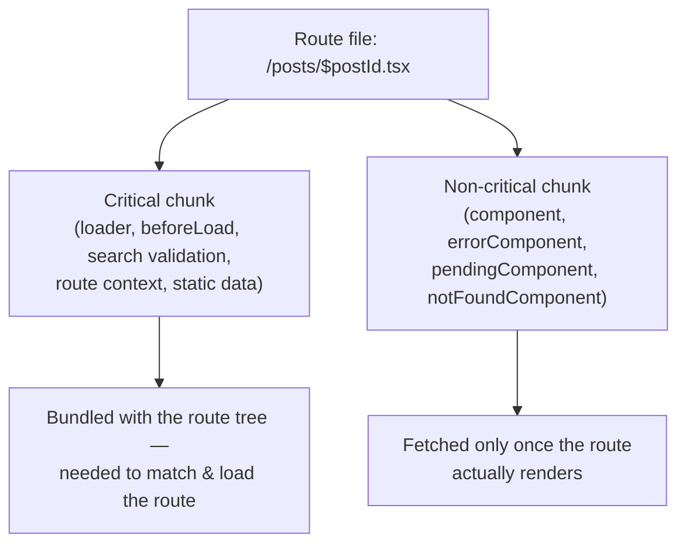

> **Verified against** `@tanstack/react-start` v1.168.x — July 2026.

## Code splitting is Router's job, not Start's

Start doesn't implement its own bundling strategy. Routing, and the code splitting that comes with it, is TanStack Router's — Start just runs on top of it. The router's file-based routing plugin can split each route file into a critical chunk (path parsing, search-param validation, loaders, `beforeLoad`, route context, static data, links, scripts, styles — everything needed to *match and load* the route) and a non-critical chunk (the component itself, plus error/pending/not-found components) that only loads once the route actually renders.



In plain TanStack Router (used standalone, outside Start), this is controlled by an explicit key on the router's Vite plugin:

```ts
// TanStack Router's own Vite plugin, used standalone
import { tanstackRouter } from '@tanstack/router-plugin/vite'

export default defineConfig({
  plugins: [
    tanstackRouter({
      autoCodeSplitting: true,
    }),
    react(),
  ],
})
```

:::note
I could not find a Start-specific docs page that documents `autoCodeSplitting` (or an equivalent key) as part of `tanstackStart()`'s own config surface — the guide page for it 404s as of this writing. `tanstackStart()` bundles the router's plugin internally, so route-based splitting is almost certainly active by default in a scaffolded Start app, matching the behavior above. But I can't point you to an authoritative Start doc confirming the exact key name or default inside `tanstackStart({...})` itself. If you need to control this explicitly, check your installed `@tanstack/react-start` version's plugin source or the current docs rather than trusting this book (or any other secondhand source) on the exact key.
:::

What you can rely on without qualification: route components are split per route out of the box in a standard Start app — you don't need to reach for `React.lazy()` yourself to get per-route chunks. Reach for manual `lazy()` only for things *within* a route that are heavy and conditionally rendered (a chart library behind a tab, a rich text editor behind an "edit" toggle) — that's ordinary React code splitting, unrelated to the router.

## Custom server entry

Every Start app has a server entry point that turns incoming HTTP requests into your app's response — SSR render, server route dispatch, server function RPC. By default this is provided for you via `@tanstack/react-start/server-entry`, and you never see it. Most apps never need to touch this.

Reach for a custom entry when you need to run code that has to happen for *every* request, at a layer below routes and middleware — instantiating a platform-specific client (a Cloudflare `env` binding wrapper, a custom logger with request-scoped context), or wiring a non-default handler pipeline.

Create `src/server.ts`:

```ts
// src/server.ts
import handler, { createServerEntry } from '@tanstack/react-start/server-entry'

export default createServerEntry({
  fetch(request) {
    return handler.fetch(request)
  },
})
```

`createServerEntry` just gives you a typed wrapper around the `{ fetch(request) }` interface Start expects — the object needs a `fetch` method that takes a standard `Request` and returns a `Response` (or a promise of one), same shape as a Worker or any fetch-based server.

For finer control over the rendering pipeline itself — swapping the stream handler, injecting request context that's typed and available to every loader and server function — compose `createStartHandler` with the default handler instead of only delegating to it:

```ts
// src/server.ts
import {
  createStartHandler,
  defaultStreamHandler,
} from '@tanstack/react-start/server'
import { createServerEntry } from '@tanstack/react-start/server-entry'

const fetch = createStartHandler({
  // request-scoped context available to loaders, server functions, and middleware
})(defaultStreamHandler)

export default createServerEntry({ fetch })
```

Request context registered this way is typed through the same `Register` interface augmentation used elsewhere in Start — the same mechanism the [middleware chapter](../../03-server-functions-forms-security/03-middleware/) covers for request-scoped values, just wired one layer earlier.

### Why this shows up in deployment configs

Custom entries are the reason `wrangler.jsonc`'s `main` field sometimes points somewhere other than the default. If your Cloudflare Worker config looks like this:

```jsonc
// wrangler.jsonc
{
  "main": "src/server.ts",
}
```

that's pointing at *your* custom entry, not Start's default — because a Cloudflare Worker needs a single exported `fetch` handler at a known path, and a custom `server.ts` is how you supply request-scoped bindings (KV, D1, environment) to that handler before Start's routing takes over. If you haven't written a custom entry, `main` points at the framework's own generated entry instead. See the [Cloudflare Workers deployment chapter](../../08-deployment/02-cloudflare-workers/) for the full worked example, including where bindings get threaded into request context.
