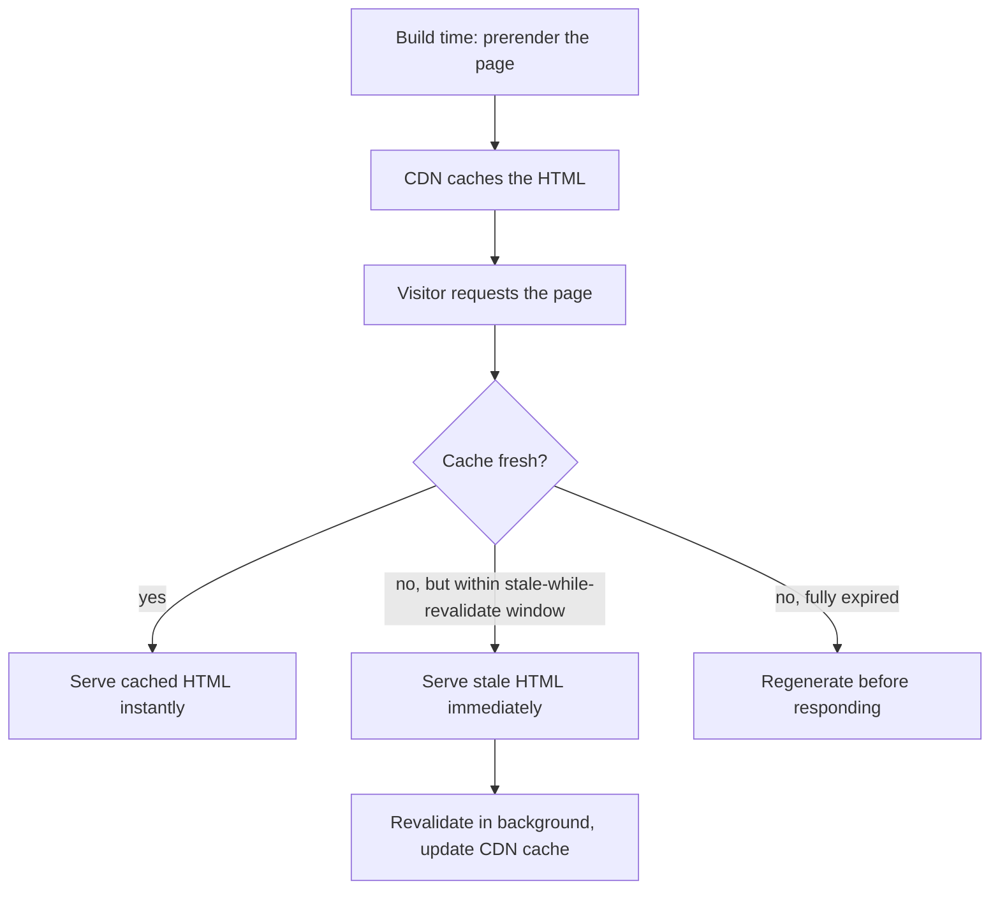

> **Verified against** `@tanstack/react-start` v1.168.x — July 2026.

:::caution
🟡 **Experimental / unsettled.** Everything in this chapter is real and currently works, but as of this writing its guide lives at `tanstack.com/start/**v0**/docs/...` — not the `latest` path every other guide in this book links to. That's not a typo in a URL; it's a signal. `v0` is where TanStack parks docs that haven't been promoted to the current stable set. Treat ISR as a working pattern you can prototype with, not a committed feature surface — re-check the current docs before you build a production revalidation pipeline on it, because the config keys or mechanism could still move.
:::

## What ISR means in Start

Elsewhere ISR is a named framework feature with its own config block. In Start, it isn't a separate primitive — it's standard HTTP caching (the same `Cache-Control` mechanism from the [previous chapter](../02-caching-and-env-vars/)) applied in a specific pattern: prerender at build time, serve from a CDN, let the CDN cache expire and quietly refetch in the background instead of forcing every visitor to wait for a rebuild.



## The mechanism: three header directives doing the work

A route sets its own cache policy through the same `headers` mechanism as any other route, or a server function sets it via `setResponseHeaders`:

```tsx
// A route that's cheap to regenerate but doesn't need to be instant-fresh
export const Route = createFileRoute('/blog/$slug')({
  headers: () => ({
    'Cache-Control': 'public, max-age=3600, s-maxage=3600, stale-while-revalidate=86400',
  }),
  // ...loader, component
})
```

- **`max-age=3600`** — the browser treats this as fresh for an hour.
- **`s-maxage=3600`** — the CDN (a "shared cache") treats it as fresh for an hour too; without this it would fall back to `max-age`.
- **`stale-while-revalidate=86400`** — for a full day after it goes stale, the CDN keeps serving the old cached copy immediately while it fetches a fresh one in the background. Visitors never wait on a regeneration; they just occasionally get content that's up to an hour or so old.

The same pattern applies to a server function backing a specific piece of data, not just a whole page:

```ts
export const getProduct = createServerFn({ method: 'GET' }).handler(async ({ data }) => {
  const product = await db.product.findUnique({ where: { id: data.id } })
  setResponseHeaders(
    new Headers({ 'Cache-Control': 'public, max-age=300, stale-while-revalidate=600' }),
  )
  return product
})
```

## On-demand revalidation

Time-based expiry alone means "at most an hour stale," which is often good enough — but a CMS publish event shouldn't have to wait for a timer. The pattern is a webhook-triggered server route that purges the CDN's cached copy directly, via your CDN provider's own purge API (Cloudflare, Netlify, and Vercel each expose one). Once purged, the next request regenerates the page and the CDN caches the new result.

This is the same revalidation trigger the [CMS pattern chapter](../../06-patterns/02-cms-pattern/) uses for "editor publishes → page updates" — see that chapter for the webhook route shape. It carries the same 🟡 caveat: functional today, not a settled API.

:::note
Don't confuse this CDN-level `stale-while-revalidate` with TanStack Query's client-side `staleTime`/`gcTime`. They solve adjacent problems at different layers — CDN caching decides what HTML a *new* visitor's request gets served; Query's cache decides how long an *already-loaded* client holds onto data before refetching. A production app typically uses both, but they're configured independently and don't share settings.
:::
