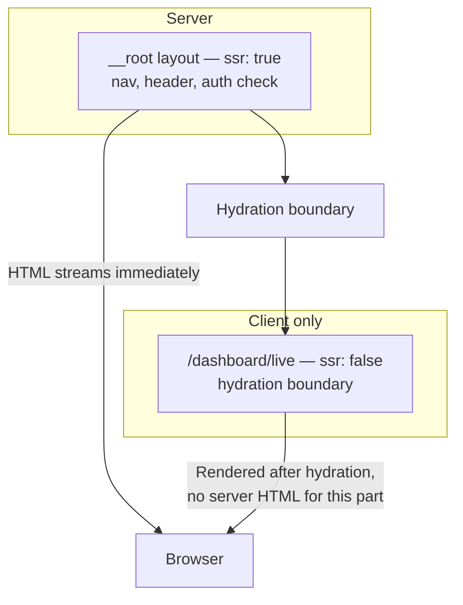

> **Verified against** `@tanstack/react-start` v1.168.x — July 2026.

## The idea

Not every part of a page benefits from server rendering. Your nav, header, and layout are the same for every visitor and barely change — server-rendering them is free SEO and a fast first paint. A live dashboard widget, an editor, or anything that's different on every load gets nothing from being rendered on the server first — the HTML is often stale before it reaches the browser, and you paid a render for it anyway.

The shell pattern splits a page along that line: a parent route renders the frame on the server, a child route renders its content only on the client.



## The mechanism

This is TanStack Router's per-route `ssr` option, not a Start-specific API — see [Selective SSR](../../02-rendering-model/03-selective-ssr/) for the full decision matrix between `ssr: true`, `'data-only'`, and `false`. The shell pattern is just one specific way to use it: set it on a *child* route while its *parent* stays `ssr: true`, so the layout still streams from the server even though the nested content doesn't.

```tsx
// routes/dashboard/route.tsx — the shell
export const Route = createFileRoute('/dashboard')({
  ssr: true, // default — server-renders nav, header, layout
  component: DashboardLayout,
})

function DashboardLayout() {
  return (
    <div className="dashboard">
      <DashboardNav />
      <Outlet /> {/* renders /dashboard/live below */}
    </div>
  )
}
```

```tsx
// routes/dashboard/live.tsx — the CSR content
export const Route = createFileRoute('/dashboard/live')({
  ssr: false, // this route renders client-only
  component: LivePositions,
})

function LivePositions() {
  // no server-fetched initial data here — this mounts and fetches
  // entirely in the browser, after hydration
  const { data } = useQuery(livePositionsQueryOptions())
  return <PositionsTable rows={data} />
}
```

The server response for `/dashboard/live` still includes the full shell — nav, header, layout — streamed and indexable. What it doesn't include is any markup for the live content itself; that's an empty boundary until the client takes over, fetches, and renders it.

## Why not just `ssr: false` on the whole page?

Because then you lose the shell's SSR benefits too — the nav and header would also wait for client-side JS before painting, and a search crawler would see an empty page instead of your (perfectly indexable) layout and copy. The whole point of splitting at the route boundary is that the parent and child are rendered under completely different rules while still composing as one page. That's a decision you can only make per-route, not per-page — which is exactly what nesting `ssr: false` one level below an `ssr: true` parent gives you.

## The experimental variant: RSC-streamed shell

There's a more advanced version of this same idea using React Server Components: instead of a static SSR shell with a plain hydration boundary, the shell streams as RSC output with a slot the client fills in independently, without a full client-side re-render of the shell around it. This gets you finer streaming granularity — but it's built on Start's RSC support, which is experimental today. See [RSC in Start Today](../../09-appendices/01-rsc-in-start-today/) before reaching for it; the `ssr: false` boundary above is the stable, documented way to build this pattern right now.

:::tip
Use this pattern when the CSR region needs its own loading state anyway — a spinner or skeleton while live data loads is normal UX for something that updates every few seconds, so you're not giving anything up by skipping its server render. It's a poor fit for content that's genuinely the same for every visitor (that's the [CMS pattern](../02-cms-pattern/) instead) or where the "live" part is truly sub-second, tick-by-tick data (see the [trading pattern](../03-trading-realtime-pattern/) for why that needs a different transport, not just a different `ssr` value).
:::
