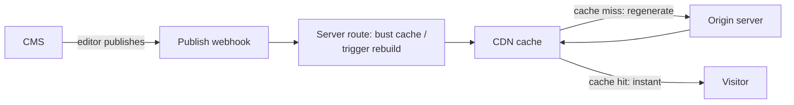

> **Verified against** `@tanstack/react-start` v1.168.x — July 2026.

## The shape of the problem

A marketing site, docs site, or blog backed by a CMS has a specific traffic pattern: thousands of reads for every one write. Rendering the same unchanged page on every request is wasted work. The right default is to render each page once, at build time, and serve the static result until the content actually changes.



## Prerender content pages, per route

Turn on prerendering with crawling so new pages get picked up automatically, then use the `pages` array where you need explicit control — forcing a route in, excluding a draft-only route, or fixing the sitemap's [known duplicate-index-route bug](../../05-advanced-config/01-prerendering-and-spa-mode/):

```ts
// vite.config.ts
tanstackStart({
  prerender: {
    enabled: true,
    crawlLinks: true, // home page links to /blog, which links to each post — all discovered
  },
  pages: [
    { path: '/blog/draft-post', prerender: { enabled: false } },
  ],
  sitemap: {
    enabled: true,
    host: 'https://example.com',
  },
}),
```

Full config keys, defaults, and the sitemap's real limitations are covered in [Prerendering & SPA Mode](../../05-advanced-config/01-prerendering-and-spa-mode/) — this pattern is just that config applied to a specific app shape.

## Preview mode: let editors see drafts without going live

A prerendered page can't show unpublished content — it was rendered before the draft existed. Editors still need to preview it. The pattern is a signed cookie that flips *one route* from prerendered to server-rendered for the duration of a preview session, while every other visitor keeps getting the static build:

```tsx
// routes/blog/$slug.tsx
export const Route = createFileRoute('/blog/$slug')({
  ssr: ({ context }) => (context.isPreview ? true : 'data-only'),
  loader: async ({ params, context }) => {
    return getPost({ data: { slug: params.slug, includeDrafts: context.isPreview } })
  },
  component: BlogPost,
})
```

`context.isPreview` comes from a `beforeLoad` (or route middleware) that checks for the signed preview cookie and verifies it — never trust an unsigned cookie to gate draft content, since anyone could set one in their browser:

```ts
// A server function backing preview-cookie verification
const verifyPreviewToken = createServerFn({ method: 'GET' }).handler(async () => {
  const token = getCookie('cms_preview')
  if (!token) return { isPreview: false }
  const valid = await verifySignedToken(token, process.env.PREVIEW_SECRET)
  return { isPreview: valid }
})
```

This is the same `ssr` per-route mechanism the [shell pattern](../01-shell-pattern/) uses, applied to a different problem: there it splits a page across two routes permanently; here it flips one route's rendering mode conditionally, based on who's asking. See [Selective SSR](../../02-rendering-model/03-selective-ssr/) for the full decision matrix.

## Revalidation: publish webhook busts the cache

Prerendered pages are static until something tells the CDN otherwise. The CMS side of that is a publish webhook hitting a server route that purges the CDN's cached copy for the affected path(s):

```ts
// routes/api/revalidate.ts
export const Route = createFileRoute('/api/revalidate')({
  server: {
    handlers: {
      POST: async ({ request }) => {
        const signature = request.headers.get('x-cms-signature')
        if (!verifyWebhookSignature(signature, process.env.CMS_WEBHOOK_SECRET)) {
          return new Response('Unauthorized', { status: 401 })
        }
        const { slug } = await request.json()
        await purgeCdnCache(`/blog/${slug}`) // call your CDN's purge API
        return new Response('OK')
      },
    },
  },
})
```

The next visitor to that path gets a fresh regeneration, and the CDN caches it again from there. This is the on-demand half of the ISR pattern covered in [ISR](../../05-advanced-config/04-isr/) — and it carries the same caveat that chapter states plainly: 🟡 the current guide for this still lives on an unsettled `v0` docs path, so verify the exact mechanism against current docs before depending on it for a real publish pipeline. What's stable and safe to build on today is the underlying primitive — a normal server route calling your CDN's purge API — even if the "ISR" framing around it isn't a committed feature yet.

:::tip
Don't reach for preview mode or webhook revalidation until you actually need them. A CMS-backed site with infrequent publishes and no live-preview requirement is well served by prerendering alone, rebuilt on a schedule or on deploy. Add preview mode when editors ask "can I see it before it's live," and add webhook revalidation when "rebuild the whole site on every publish" gets too slow.
:::
