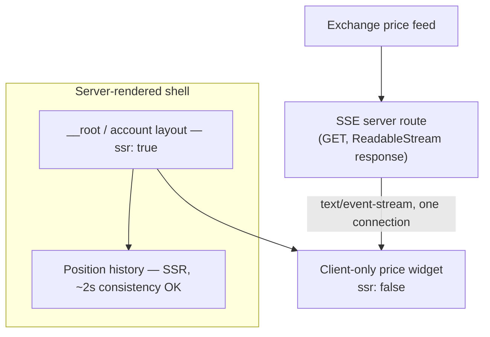

> **Verified against** `@tanstack/react-start` v1.168.x — July 2026.

## Server-rendering a live price is a wasted render

A trading UI has two kinds of data with completely different lifetimes. Account info, position history, layout — these change on the timescale of a page load, and server-rendering them is a straightforward win. A price ticker changes every second or faster. By the time SSR'd HTML for a price reaches the browser, it's already wrong. You paid for a render whose output was stale before the response finished streaming.

The fix is the same [shell pattern](../01-shell-pattern/) mechanism, applied deliberately: the account shell stays server-rendered, the live price region is `ssr: false` and fetches on the client through a channel built for continuous updates, not a channel built for one-shot HTML.



## The gap you need to know about: no native WebSocket support

:::danger
As of this writing, **TanStack Start cannot perform a WebSocket upgrade at all** — not "undocumented," actually broken, in dev, preview, and production. This is a real architectural gap, not a missing guide.

The cause is specific: Start's server runs on `srvx` (0.11.x) on top of `h3` v2. h3 v2 exposes `defineWebSocketHandler`, which attaches its WebSocket hooks (via `crossws`) through a `.crossws` property on the response — but `srvx` 0.11.x doesn't read that property, so the upgrade handshake never happens. In dev and preview specifically, Vite's middleware only ever calls `.fetch()` on the server entry, which can't attach a WS handler either way. There's a community-known escape hatch — setting `VITE_USE_NITRO=true` falls back to the older Nitro-based server, which does support WebSockets — but that's a workaround around the current default architecture, not a supported feature of it. Verify current status before depending on this; it's the kind of gap that gets fixed without much fanfare once it does.
:::

Two supported ways around this, neither of which is "wait for WebSocket support":

**1. Server-Sent Events via a server route.** A server route (file-based API route) can return a `Response` with a `ReadableStream` body, which is exactly what SSE is — a long-lived HTTP response the client reads incrementally. This is a standard Web API capability of any route that returns a raw `Response`, not something Start invented, but it's the practically-supported way to push server data continuously today:

```ts
// routes/api/prices.ts
export const Route = createFileRoute('/api/prices')({
  server: {
    handlers: {
      GET: async () => {
        const stream = new ReadableStream({
          async start(controller) {
            const unsubscribe = priceFeed.subscribe((tick) => {
              controller.enqueue(`data: ${JSON.stringify(tick)}\n\n`)
            })
            // clean up when the client disconnects
          },
        })
        return new Response(stream, {
          headers: {
            'Content-Type': 'text/event-stream',
            'Cache-Control': 'no-cache',
            Connection: 'keep-alive',
          },
        })
      },
    },
  },
})
```

The client-only widget consumes it with the standard `EventSource` API, same as it would against any SSE endpoint outside of Start.

Start also documents a related but distinct mechanism worth knowing about: a `createServerFn` handler can itself return a `ReadableStream` or be an `async function*` generator, and the client gets a typed stream back from calling it — see [Streaming Data from Server Functions](https://tanstack.com/start/latest/docs/framework/react/guide/streaming-data-from-server-functions). That's RPC streaming over a server function call (read with `.getReader()` or `for await`), not `EventSource`-compatible SSE — reach for it when your own client code is the only consumer and you want typed chunks, and reach for the server-route-plus-`EventSource`-style-SSE approach above when you specifically need standard `text/event-stream` semantics (built-in reconnect, multiple consumers, non-Start clients).

**2. A separate WebSocket service.** Run price streaming on its own service — a small dedicated WS server, or a managed pub/sub service — and have the browser connect to it directly, bypassing Start's server entirely. This is the better choice at real trading-desk scale: WebSocket connections are stateful and long-lived in a way that doesn't fit cleanly into Start's request/response server functions anyway, and decoupling the feed from your app server means a redeploy of one doesn't drop every open connection to the other.

## Where TanStack DB fits, and where it doesn't

TanStack DB's synced collections (the Electric/Postgres backend, specifically) target roughly 2-second consistency — that's the sync engine's actual latency budget, not a configurable knob you can tighten. That's a fine fit for **positions, order history, account balances** — data that changes occasionally and where "a couple seconds behind" is invisible to a user. It is the wrong tool for **tick-by-tick prices** — you'd be routing sub-second data through a sync layer built around multi-second consistency, and you'd lose regardless of how you tuned it. See [TanStack DB](../../04-state-and-data/02-tanstack-db/) for the sync backend details and its own SSR caveats (client-only today).

Concretely: positions and order history are TanStack DB collections, rendered server-side or hydrated normally. The price ticker is a plain `useState`/`useSyncExternalStore` fed by an `EventSource` (or a WebSocket, per the service pattern above) — not a DB collection, not SSR'd, not going through Query's cache. Two different tools, chosen because the data has two genuinely different shapes, not from indecision.

:::note
It's tempting to make the whole account shell `ssr: false` "to keep things simple" once part of the page is client-only. Resist it — the account info and position history are exactly the kind of content that benefits from SSR (auth-gated but not fast-changing), and losing that render for the sake of uniformity throws away real first-paint speed for no reason. Split at the route boundary, per the [shell pattern](../01-shell-pattern/), rather than picking one rendering mode for the whole page.
:::
