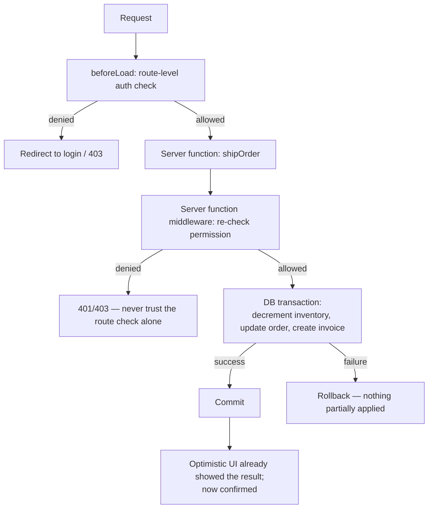

> **Verified against** `@tanstack/react-start` v1.168.x — July 2026.

## What's different about this shape

An ERP-style app (inventory, order management, back-office tooling — anything internal, form-and-table heavy, behind auth) has different priorities than a marketing site or a trading dashboard. Nobody's judging first paint against a Lighthouse score; users are logged in, staring at the same screen for hours, and the thing that actually matters is that the numbers are right and a half-finished multi-step operation never leaves data in an inconsistent state. This pattern is about wiring forms, tables, and permissions so that correctness holds up under real usage — not about a novel rendering trick.



## Forms: one schema, shared client and server validation

This pattern doesn't introduce new form API — it's the direct application of [`@tanstack/react-form-start`](../../03-server-functions-forms-security/05-forms/) to a form-and-table-heavy app. The reason it matters more here than elsewhere: ERP forms tend to have real business validation (can't ship more than what's in stock, can't apply a discount past a role-based ceiling), and that validation has to hold whether or not the client's JS ran — a form re-submitted through an automation tool or with JS disabled still has to be checked server-side, not just client-side. One `formOptions` schema shared by both sides is what makes that not mean writing the validation twice. See the forms chapter for the actual API — `createServerValidate`, `mergeForm`, progressive enhancement — this pattern just relies on it holding.

## Tables: the manual row model, because there's no dedicated adapter

TanStack Table has no Start-specific integration package, and there isn't a missing adapter waiting to be built — the manual/server-side row model plus a normal loader **is** the whole pattern:

1. The loader reads page, sort, and filter state from the URL's search params.
2. It calls a server function that fetches exactly that slice of data — the one page, in that sort order, matching that filter — not the whole dataset.
3. Table renders whatever it's handed. It doesn't paginate, sort, or filter anything itself; it just needs to be told the shape of the full result via `manualPagination`/`manualSorting` and told the totals it can't infer on its own.
4. Any UI interaction (clicking a column header, changing page) calls `navigate({ search })`, which changes the URL, which re-runs the loader, which fetches the new slice.

```tsx
// routes/orders/index.tsx
const searchSchema = z.object({
  page: z.number().default(0),
  sortBy: z.string().optional(),
  sortDir: z.enum(['asc', 'desc']).optional(),
})

export const Route = createFileRoute('/orders/')({
  validateSearch: searchSchema,
  loaderDeps: ({ search }) => search,
  loader: ({ deps }) => getOrdersPage({ data: deps }),
  component: OrdersTable,
})
```

```tsx
function OrdersTable() {
  const { rows, rowCount } = Route.useLoaderData()
  const navigate = Route.useNavigate()
  const { page, sortBy, sortDir } = Route.useSearch()

  const table = useReactTable({
    data: rows,
    columns,
    getCoreRowModel: getCoreRowModel(),
    manualPagination: true,
    manualSorting: true,
    rowCount, // Table can't infer this from a partial slice — you have to supply it
    state: {
      pagination: { pageIndex: page, pageSize: 50 },
      sorting: sortBy ? [{ id: sortBy, desc: sortDir === 'desc' }] : [],
    },
    onPaginationChange: (updater) => {
      const next = typeof updater === 'function' ? updater({ pageIndex: page, pageSize: 50 }) : updater
      navigate({ search: (prev) => ({ ...prev, page: next.pageIndex }) })
    },
    onSortingChange: (updater) => {
      const [sort] = typeof updater === 'function' ? updater([]) : updater
      navigate({ search: (prev) => ({ ...prev, sortBy: sort?.id, sortDir: sort?.desc ? 'desc' : 'asc' }) })
    },
  })

  return <table>{/* render table.getHeaderGroups() / table.getRowModel().rows as usual */}</table>
}
```

```ts
// The server function fetching exactly the requested slice
const getOrdersPage = createServerFn({ method: 'GET' })
  .validator(z.object({ page: z.number(), sortBy: z.string().optional(), sortDir: z.enum(['asc', 'desc']).optional() }))
  .handler(async ({ data }) => {
    const [rows, rowCount] = await db.order.findAndCount({
      skip: data.page * 50,
      take: 50,
      orderBy: data.sortBy ? { [data.sortBy]: data.sortDir ?? 'asc' } : undefined,
    })
    return { rows, rowCount }
  })
```

`rowCount` (or `pageCount`) is required once `manualPagination` is on — Table has no way to know the total dataset size from a 50-row slice, so it can't render page controls without being told. The URL is the source of truth for table state, which is a feature here, not an accident: a bookmarked or shared link to "orders, sorted by date, page 3" reproduces exactly that view.

## Multi-step operations: transactions, not a chain of independent writes

"Ship order" touching inventory, the order record, and an invoice in one logical action is where naive implementations go wrong — three separate writes that can each succeed or fail independently leave you with, say, decremented inventory and no invoice if the third call fails. Two supported ways to make this atomic:

- **A single server function wrapping a database transaction**, when the client doesn't need to see intermediate optimistic state — commit or rollback happens entirely server-side, and the client just awaits the result.
- **TanStack DB staged transactions** (`createTransaction`/`createOptimisticAction`) when you want the UI to reflect the change immediately, across multiple collections, and roll back cleanly in the UI if the server rejects it. See [TanStack DB](../../04-state-and-data/02-tanstack-db/) for how staged mutations and rollback actually work — this pattern is choosing between "server transaction, client just waits" and "client shows it now, DB unwinds it if the server says no," not re-deriving the DB API.

```ts
const shipOrder = createServerFn({ method: 'POST' })
  .validator(z.object({ orderId: z.string() }))
  .middleware([requirePermission('orders:ship')])
  .handler(async ({ data }) => {
    return db.$transaction(async (tx) => {
      await tx.inventory.decrement({ where: { orderId: data.orderId } })
      const order = await tx.order.update({ where: { id: data.orderId }, data: { status: 'shipped' } })
      await tx.invoice.create({ data: { orderId: data.orderId } })
      return order
      // any throw inside here rolls back all three writes together
    })
  })
```

## Permissions, checked twice

A "Ship Order" button hidden from users without the right role is a UX nicety, not a security boundary — anyone can call the underlying server function directly with the right payload, role check or no button. This pattern checks permission at two layers, deliberately redundant:

- **Route-level, in `beforeLoad`**: keeps someone without access from even loading the page — cheap, coarse, good for UX (redirect to login/403 before rendering anything they shouldn't see).
- **Data-level, in server function middleware**: the actual enforcement, checked again on every mutating call regardless of what the UI showed. This is what stops the "call the server function directly" bypass.

```ts
const requirePermission = (permission: string) =>
  createMiddleware().server(async ({ next, context }) => {
    if (!context.user?.permissions.includes(permission)) {
      throw new Error('Forbidden')
    }
    return next()
  })
```

See [Middleware](../../03-server-functions-forms-security/03-middleware/) for the full middleware API this builds on. The rule worth remembering: if a permission check only exists in one layer, it's not a permission check, it's a suggestion.
