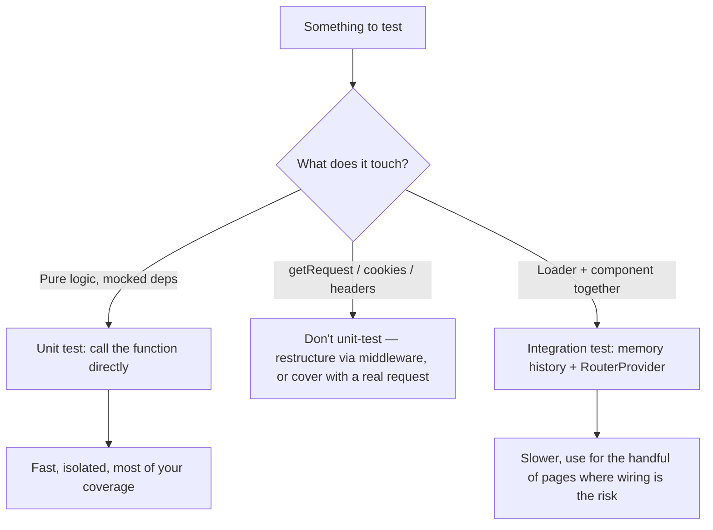

> **Verified against** `@tanstack/react-start` v1.168.x — July 2026.

:::note
There is no official TanStack Start testing guide as of this writing. The docs overview links to a Server Components guide but nothing under `guide/testing` — the URL doesn't exist. Everything below is general Vitest/Testing Library practice applied to Start's primitives, not framework-provided testing APIs. Where a pattern isn't officially documented, it's flagged 🔴.
:::

## The core idea: a server function is just an async function

`createServerFn(...).handler(...)` returns a callable. Nothing about testing it is exotic once you accept that — you call it, you await it, you assert on the result.

```ts
// src/server/get-order-total.ts
import { createServerFn } from '@tanstack/react-start'
import { z } from 'zod'
import { db } from '~/db'

export const getOrderTotal = createServerFn({ method: 'GET' })
  .validator(z.object({ orderId: z.string() }))
  .handler(async ({ data }) => {
    const order = await db.order.findUnique({ where: { id: data.orderId } })
    if (!order) throw new Error('Order not found')
    return order.lines.reduce((sum, l) => sum + l.qty * l.price, 0)
  })
```

```ts
// get-order-total.test.ts
import { describe, expect, it, vi } from 'vitest'
import { getOrderTotal } from './get-order-total'
import { db } from '~/db'

vi.mock('~/db', () => ({
  db: { order: { findUnique: vi.fn() } },
}))

describe('getOrderTotal', () => {
  it('sums line items', async () => {
    vi.mocked(db.order.findUnique).mockResolvedValue({
      lines: [{ qty: 2, price: 10 }, { qty: 1, price: 5 }],
    } as any)

    const total = await getOrderTotal({ data: { orderId: 'o_1' } })
    expect(total).toBe(25)
  })
})
```

🔴 A caveat worth knowing: calling the *composed* export (the thing `createServerFn` returns, not a separate handler you export yourself) only runs the real handler in-process because Vitest executes your test file in a Node environment, not through the browser-targeted half of Start's Vite plugin. That's the same reason a loader can call a server function directly during SSR without a network hop — on the server, the call *is* the handler. Nothing in Start's docs formally guarantees this for test runners, but it follows from how the framework already behaves, and it's the pattern most teams reach for. If your Vitest config ever runs test files through a browser-mode environment (`jsdom`/`happy-dom`) with the Start Vite plugin applying its client transform, this stops being true — the import may resolve to an RPC stub that tries to `fetch()` instead. Keep handler unit tests in a plain `environment: 'node'` project to avoid that ambiguity.

## Request context is the part that doesn't unit-test cleanly

If a handler reads `getRequest()` from `@tanstack/react-start/server` — for a cookie, an auth header, whatever — that call needs an active request context that Start populates per-request. Outside of a real request, there's no documented, supported way to fabricate one for a test.

```ts
import { getRequest } from '@tanstack/react-start/server'

export const getCurrentUser = createServerFn({ method: 'GET' }).handler(async () => {
  const request = getRequest()
  const token = request.headers.get('authorization')
  // ...
})
```

Two ways out, in order of preference:

1. **Don't read it inside the handler at all.** Pull whatever you need out via middleware or a validator instead, so the handler itself takes it as plain input. `createAuthedFn` middleware that resolves a user and puts it on `context` (see [server function middleware](../../03-server-functions-forms-security/03-middleware/)) turns "reads `getRequest()`" into "receives `context.user`" — which is trivial to mock, no request object required.
2. **If you genuinely can't avoid it**, isolate the `getRequest()`-touching code into the thinnest possible wrapper and don't unit-test that wrapper at all — cover it with an integration test that goes through a real request (see below) instead of trying to fake request context. 🔴 There's no supported Start API for constructing a fake request context in-process; anything you build yourself here is your own scaffolding, not a documented pattern.

## Testing loaders

A loader is a function too, but it's attached to a route, which makes "just call it" slightly less obvious. Two approaches cover most cases.

**Unit test the loader logic directly.** Keep the loader thin and give it a name you can import:

```ts
// src/routes/orders.$orderId.tsx
import { createFileRoute } from '@tanstack/react-router'
import { getOrderTotal } from '~/server/get-order-total'

export const orderLoader = async ({ params }: { params: { orderId: string } }) => {
  const total = await getOrderTotal({ data: { orderId: params.orderId } })
  return { total }
}

export const Route = createFileRoute('/orders/$orderId')({
  loader: ({ params }) => orderLoader({ params }),
  component: OrderPage,
})
```

```ts
import { describe, expect, it, vi } from 'vitest'
import { orderLoader } from './orders.$orderId'
import { getOrderTotal } from '~/server/get-order-total'

vi.mock('~/server/get-order-total')

it('loads the order total', async () => {
  vi.mocked(getOrderTotal).mockResolvedValue(25)
  const data = await orderLoader({ params: { orderId: 'o_1' } })
  expect(data).toEqual({ total: 25 })
})
```

This sidesteps any question about what's publicly stable on the `Route` object — you're testing a plain function, and the route config just wires it in.

**Render the route and assert on output**, when what you actually care about is "does the page show the right thing given this loader result." This is standard TanStack Router testing, not Start-specific: build a router with `createMemoryHistory`, render it with `@testing-library/react`, and let the real loader run (mocking whatever it calls underneath, same as above).

```tsx
import { render, screen } from '@testing-library/react'
import { createMemoryHistory, createRouter, RouterProvider } from '@tanstack/react-router'
import { routeTree } from './routeTree.gen'

it('renders the order total', async () => {
  const router = createRouter({
    routeTree,
    history: createMemoryHistory({ initialEntries: ['/orders/o_1'] }),
  })
  render(<RouterProvider router={router} />)

  expect(await screen.findByText(/25/)).toBeInTheDocument()
})
```

This is heavier — it exercises routing, loading states, and rendering together — but it's the closer-to-real option when a loader's correctness depends on how the component actually consumes `Route.useLoaderData()`.



## What this doesn't cover

Nothing here exercises the actual RPC boundary — the fetch that a real browser makes to a real server function endpoint, with real serialization. If that's the risk you're worried about (a validator that behaves differently over the wire, a middleware that only runs on genuine HTTP requests), you need an end-to-end test against a running dev/preview server — Playwright against `vite preview` or similar. That's outside Start-specific tooling entirely; it's the same story as testing any server.
