> **Verified against** `@tanstack/react-start` v1.168.x — July 2026.

Three levers matter most in a Start app, roughly in order of how often they're the actual problem: loaders that block each other for no reason, a client bundle nobody's looked at since setup, and a prefetch strategy left on the default.

## Bundle analysis

Vite doesn't print a bundle breakdown by default — you add a plugin. `rollup-plugin-visualizer` is the standard choice and works fine alongside `tanstackStart()`:

```ts
// vite.config.ts
import { defineConfig } from 'vite'
import { tanstackStart } from '@tanstack/react-start/plugin/vite'
import viteReact from '@vitejs/plugin-react'
import { visualizer } from 'rollup-plugin-visualizer'

export default defineConfig({
  plugins: [
    tanstackStart(),
    viteReact(),
    process.env.ANALYZE &&
      visualizer({ open: true, gzipSize: true, filename: 'stats.html' }),
  ].filter(Boolean),
})
```

```bash
ANALYZE=true bun run build
```

Gate it behind an env var — you don't want a browser tab popping open on every CI build. If you'd rather not touch `vite.config.ts` at all, `bunx vite-bundle-visualizer` runs a one-off build with the same treemap output against your existing config.

What you're looking for: a client route that pulled in a server-only dependency (Prisma, a heavy PDF library, an entire SDK) because a server function's types leaked into a shared module instead of a `.server.ts`-only one. The RPC compile boundary is supposed to strip server code from the client bundle — see [the compile boundary chapter](../../03-server-functions-forms-security/02-rpc-compile-boundary/) — but that only works when the server-only code is actually reachable *only* from a server function's handler. A shared "utils" file imported by both a component and a server function ships to the client whole.

## Streaming waterfalls: sequential vs. parallel loaders

This is the most common self-inflicted slowdown, and it's easy to write by accident because `await` reads top-to-bottom.

```ts
// Bad — user and orders are independent, but orders waits for user anyway
export const Route = createFileRoute('/dashboard')({
  loader: async () => {
    const user = await getUser()
    const orders = await getOrders() // doesn't need `user` for anything
    return { user, orders }
  },
})
```

```ts
// Good — both requests fire immediately
export const Route = createFileRoute('/dashboard')({
  loader: async () => {
    const [user, orders] = await Promise.all([getUser(), getOrders()])
    return { user, orders }
  },
})
```

The fix is nothing more than `Promise.all` — the point is noticing the dependency doesn't exist in the first place. If `orders` genuinely needs something out of `user` (a tenant ID, say), the sequential version is correct and there's no waterfall to fix; don't force independence that isn't there.

```mermaid
sequenceDiagram
    participant C as Client
    participant S as Server (loader)
    participant U as getUser()
    participant O as getOrders()

    rect rgb(40, 20, 20)
    Note over C,O: Sequential — 300ms total
    C->>S: navigate
    S->>U: await getUser()
    U-->>S: 150ms
    S->>O: await getOrders()
    O-->>S: 150ms
    S-->>C: response at 300ms
    end

    rect rgb(20, 40, 20)
    Note over C,O: Parallel — 150ms total
    C->>S: navigate
    par
    S->>U: getUser()
    and
    S->>O: getOrders()
    end
    U-->>S: 150ms
    O-->>S: 150ms
    S-->>C: response at 150ms
    end
```



For the case where one piece of data is slow and you don't want it blocking the rest of the page at all — not even in parallel — that's what deferred loader data (`defer()` + `<Await>`) is for. It's covered in full in [loaders and deferred data](../../02-rendering-model/02-loaders-and-deferred-data/); the short version is that `Promise.all` still waits for the slowest piece before the response starts, while a deferred value lets the response start immediately and streams that piece in when it's ready.

## Prefetch strategy

The router can start running a route's loader before the user actually navigates — on link hover, on scroll-into-view, or immediately on render. This is configured globally and can be overridden per link.

```ts
// router.tsx
import { createRouter } from '@tanstack/react-router'

export const router = createRouter({
  routeTree,
  defaultPreload: 'intent', // false by default — opt in explicitly
  defaultPreloadDelay: 50, // ms of hover/touch before a preload fires
})
```

```tsx
// override per-link
<Link to="/dashboard" preload="intent">Dashboard</Link>
<Link to="/reports" preload="viewport">Reports</Link>
```

`preload` takes `'intent'` (hover/touch, the common default), `'viewport'` (fires when the link scrolls into view via `IntersectionObserver` — good for long nav lists where hovering everything isn't realistic), or `'render'` (fires the moment the link mounts — aggressive, use for links you're near-certain the user will click next).

Preloading actually runs the loader, which means it actually calls your server functions. `defaultPreloadStaleTime` (30 seconds by default) controls how long that preloaded result stays "fresh enough" — if the real navigation happens within that window, the router uses the preloaded data instead of loading again; outside it, preloading fires again. If you're using the official Query integration, this interacts directly with Query's own `staleTime` on the same data — that interaction, and the integration itself, is covered in [TanStack Query](../../04-state-and-data/01-tanstack-query/). Don't tune `defaultPreloadStaleTime` in isolation from that chapter's guidance; the two settings are answering the same question from two different layers.

:::caution
Aggressive preloading (`'render'` on a list of links, or a low `defaultPreloadDelay`) trades network/server load for perceived speed. On a page with a hundred list items, `preload="viewport"` on all of them will fire a hundred loader calls as the user scrolls. Fine for a cheap loader; not fine for one that hits a database per row.
:::
