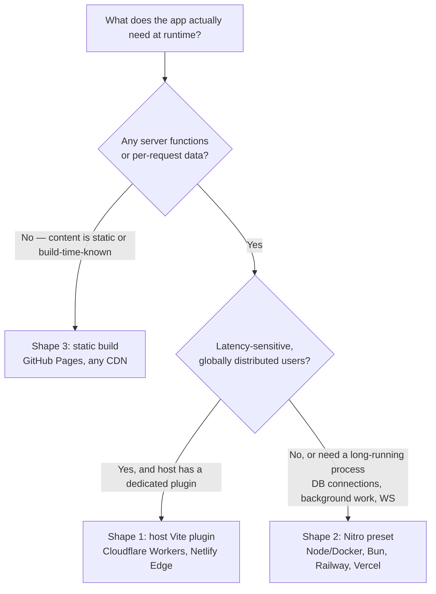

> **Verified against** `@tanstack/react-start` v1.168.x — July 2026.

Start doesn't have one deployment story — it has two, plus a special case worth knowing about because you're reading it right now. Source: the [official hosting guide](https://tanstack.com/start/latest/docs/framework/react/guide/hosting).

## Shape 1: host-specific Vite plugin

Some hosts ship a Vite plugin that hooks directly into Start's build, tailored to that host's runtime. You add the plugin, you don't think about presets. This is the shape for **Cloudflare** and **Netlify** today:

```ts
// Cloudflare
plugins: [cloudflare({ viteEnvironment: { name: 'ssr' } }), tanstackStart(), viteReact()]

// Netlify
plugins: [tanstackStart(), netlify(), viteReact()]
```

Worked example: [Cloudflare Workers](../../08-deployment/02-cloudflare-workers/).

## Shape 2: Nitro preset

Everyone else goes through [Nitro](https://nitro.build) — a server-output abstraction that targets dozens of runtimes from one build. You add the `nitro/vite` plugin and, where it can't auto-detect the target, tell it which preset to build for:

```ts
import { nitro } from 'nitro/vite'

plugins: [tanstackStart(), nitro({ preset: 'bun' }), viteReact()]
```

This is the shape for **Vercel, Node/Docker, Bun, and Railway** — same plugin, different preset (or no preset at all, when the host auto-detects). Worked example: [Node/Docker via Nitro](../../08-deployment/03-node-docker-nitro/). Quick reference for the rest: [config-delta reference](../../08-deployment/04-config-delta-reference/).

## Shape 3: no server at all

If every route can be fully prerendered and the app has no server functions, you don't need Shape 1 or 2 — you need a static file host. This handbook is that shape, concretely: it's an Astro/Starlight site built with `astro build`, deployed to GitHub Pages as static HTML with a `base: '/react-tanstack-handbook'` subpath, no Node process running anywhere. There's no server runtime to pick a preset for, because there's no server.

A Start app reaches the same shape by prerendering every route ([prerendering and SPA mode](../../05-advanced-config/01-prerendering-and-spa-mode/)) and having zero server functions left to serve at runtime — at that point "deployment" is just uploading `dist/client` to whatever static host you like. It's the cheapest and fastest shape available, and it's the wrong choice the moment you need even one dynamic server function.

## Picking a shape



The honest tie-breaker: if your host has a dedicated Vite plugin, prefer it — it's built and maintained for exactly that runtime's constraints (Cloudflare's isolate model, in particular, has sharp edges a generic preset can't fully paper over). If it doesn't, Nitro is the default path, and it covers most hosts reasonably well.
