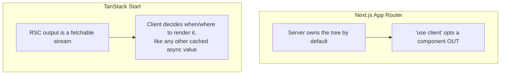

> **Verified against** `@tanstack/react-start` v1.168.x — July 2026.

:::danger[Experimental]
This entire appendix (A.1–A.3) covers **experimental** territory. Start's own docs open the Server Components guide with: "Server Components are experimental! The API may see refinements." RSC wasn't part of the v1 Release Candidate — it landed roughly April 2026 as a non-breaking `v1.x` addition (see the [version timeline](../../00-orientation/02-version-and-stability/)). Nothing in this appendix is a prerequisite for anything else in this book. Verify against the [current guide](https://tanstack.com/start/latest/docs/framework/react/guide/server-components) before building production code on any of it — this is 🟡 at best, and parts of it are closer to 🔴 where the docs themselves say the API isn't settled.
:::

## Philosophy: a stream, not a server-owned tree

Next.js's App Router makes the server the default owner of your component tree — every component is a Server Component unless you opt out with `'use client'`. The whole app orbits that decision.

Start's RSC support doesn't ask you to make that choice for the whole app. A Server Component in Start is a **value** — something you render on the server, get back as a stream, and then fetch, cache, and compose on the client the same way you'd handle any other async data. Nothing about it says "this route's tree lives on the server now." It's isomorphic-first: RSC is one more thing a route can opt into, not a mode the framework puts you in.



This isn't a value judgment on which is better — it's the same reasoning Start applies to SSR generally (see [Why TanStack Start](../../00-orientation/01-why-tanstack-start/)), extended to RSC. [Appendix A.3](../../09-appendices/03-rsc-why-it-matters/) covers TanStack's own stated reasoning for this, sourced from their blog.

## Enabling it

Three requirements, all of which need to be true at once:

1. **A build-tool plugin.** For Vite, that's [`@vitejs/plugin-rsc`](https://www.npmjs.com/package/@vitejs/plugin-rsc). Rsbuild has RSC support built in — no separate plugin needed there.
2. **A flag on Start's own plugin**: `rsc: { enabled: true }`.
3. **A runtime floor**: React 19+, and Vite 7+ (or Rsbuild 2+).

```ts
// vite.config.ts
import { defineConfig } from 'vite'
import rsc from '@vitejs/plugin-rsc'
import { tanstackStart } from '@tanstack/react-start/plugin/vite'
import viteReact from '@vitejs/plugin-react'

export default defineConfig({
  plugins: [
    rsc(),
    tanstackStart({ rsc: { enabled: true } }),
    viteReact(),
  ],
})
```

## The API surface

Two helpers cover most usage, both from `@tanstack/react-start/rsc`.

**`renderServerComponent(<Element />)`** — the simple case. Returns a renderable value you inline directly, no slots, nothing client-fillable:

```tsx
import { renderServerComponent } from '@tanstack/react-start/rsc'
import { createServerFn } from '@tanstack/react-start'

const getGreeting = createServerFn().handler(async () => {
  const Renderable = await renderServerComponent(<Greeting />)
  return { Renderable }
})
```

**`createCompositeComponent((props) => <Element />)`** — for when the server-rendered piece needs a slot the client controls (children, a render prop, a component prop). Consumed via `<CompositeComponent src={...} />`:

```tsx
import { createCompositeComponent, CompositeComponent } from '@tanstack/react-start/rsc'

const ArticleShell = createCompositeComponent((props: { title: string }) => (
  <article>
    <h1>{props.title}</h1>
    {/* children below are filled in by the client, not the server */}
  </article>
))

// client
<CompositeComponent src={articleShellSrc} title="Q3 Results">
  <LiveCommentThread />
</CompositeComponent>
```

The lower-level Flight primitives (`renderToReadableStream`, `createFromReadableStream`, `createFromFetch`) sit underneath both of these and are what you reach for outside the loader-driven happy path — traced in full in [Appendix A.2](../../09-appendices/02-rsc-streaming-mechanics/).

## Documented limitations

These are stated directly in Start's own guide, not inferred:

- **Slots are opaque on the server.** "The server cannot inspect slot content. `React.Children.map()` and `cloneElement()` won't work on `props.children`" — a composite component can't transform or introspect what the client passes into a slot, because that content doesn't exist yet when the server renders its half. Use render props to hand data *from* server *to* client instead of trying to inspect what's coming the other way.
- **Render-prop arguments must be serializable.** They travel through React's Flight protocol like everything else crossing the boundary: "strings, numbers, booleans, null, plain objects, and arrays." No functions, no class instances, no Dates-inside-arbitrary-structures beyond what Flight itself handles.
- **Start's custom serialization isn't available inside server components yet.** Quoting the guide directly: "TanStack Start's custom serialization isn't available in server components yet. Primitives, Dates, and React elements work." If you're used to Start's server functions handling richer types over the RPC boundary, that convenience doesn't currently extend into RSC — you're on native Flight serialization only, until this is addressed.

None of these are bugs to work around cleverly — they're the current, stated shape of an experimental feature. Treat them as constraints on what you build, not obstacles to route through.
