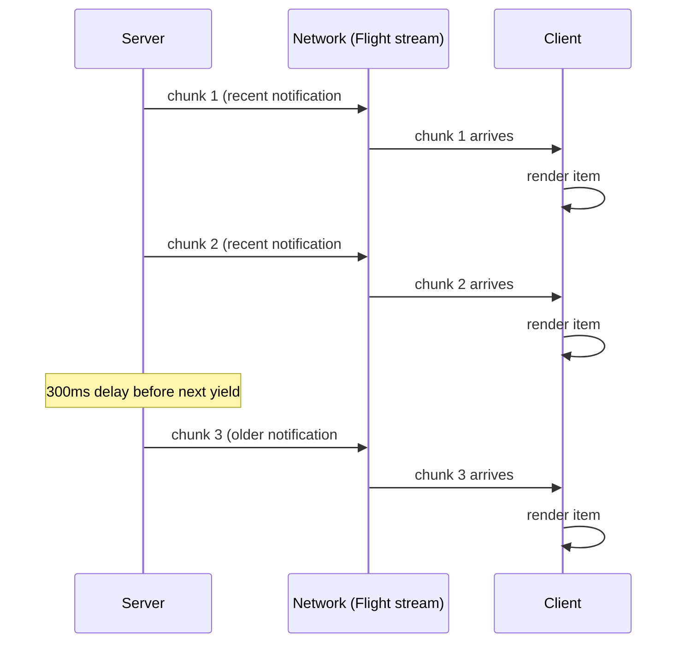

> **Verified against** `@tanstack/react-start` v1.168.x — July 2026.

:::danger[Experimental]
Part of the RSC appendix — see [A.1](../../09-appendices/01-rsc-in-start-today/) for the full experimental-status banner and enabling instructions. Everything below assumes RSC is already enabled.
:::

## In plain terms

A normal server response for data is one blob: the server finishes, serializes everything to JSON, sends it, the client parses the whole thing before it can use any of it. RSC streaming doesn't do that. The server turns a component into a **stream of bytes** — React calls this format "Flight" — and starts sending it before the whole thing is even finished rendering. The client reads that stream piece by piece, and turns each piece into real UI the moment it arrives. Nobody waits for the slowest part to render the parts that were already ready.

That's the entire idea. Everything else in this chapter is just naming the specific functions that do each half of it.

## The API trace

Everything lives in `@tanstack/react-start/rsc`.

| Function | Runs where | Does what |
|---|---|---|
| `renderToReadableStream(<El />)` | Server only | Renders a React element to a Flight `ReadableStream`. This is the thing that produces the bytes. |
| `createFromReadableStream(stream)` | Client **and** server | Decodes a Flight stream back into a React element tree you can render. |
| `createFromFetch(fetchPromise)` | Client | Convenience wrapper around `createFromReadableStream` — takes a `Promise<Response>` (i.e. the direct result of `fetch(...)`, no `await` needed first), pulls `.body` off it, and hands that to `createFromReadableStream`. |

`createFromReadableStream` working on both sides is what makes the loader pattern below possible — the server can decode its own stream synchronously during SSR instead of only being able to produce one.

## Pattern A: through a route loader

The common case — a server function renders a component to a Flight-backed value, a loader awaits it, the route reads it back like any other loader data:

```tsx
// src/server/greeting.tsx
import { createServerFn } from '@tanstack/react-start'
import { renderServerComponent } from '@tanstack/react-start/rsc'

const Greeting = () => <p>Rendered on the server, streamed to the client.</p>

export const getGreeting = createServerFn().handler(async () => {
  const Renderable = await renderServerComponent(<Greeting />)
  return { Renderable }
})
```

```tsx
// src/routes/index.tsx
import { createFileRoute } from '@tanstack/react-router'
import { getGreeting } from '~/server/greeting'

export const Route = createFileRoute('/')({
  loader: async () => {
    const { Renderable } = await getGreeting()
    return { Greeting: Renderable }
  },
  component: () => {
    const { Greeting } = Route.useLoaderData()
    return <div>{Greeting}</div>
  },
})
```

Nothing here looks different from any other loader. `renderServerComponent` and the Flight decode both happen underneath `createServerFn` and the loader/RPC machinery Start already has — you're not touching `renderToReadableStream` directly at all in this pattern.

## Pattern B: raw Flight over an API route

For cases where you want the Flight stream itself over HTTP — not routed through a server function's RPC call — a server route can return it directly, with the Flight content type:

```tsx
// src/routes/api/rsc.tsx
import { createFileRoute } from '@tanstack/react-router'
import { renderToReadableStream } from '@tanstack/react-start/rsc'

export const Route = createFileRoute('/api/rsc')({
  server: {
    handlers: {
      GET: async () => {
        const stream = renderToReadableStream(<div>Streamed from an API route.</div>)
        return new Response(stream, {
          headers: { 'Content-Type': 'text/x-component' },
        })
      },
    },
  },
})
```

```tsx
// client
import { createFromFetch } from '@tanstack/react-start/rsc'

const element = await createFromFetch(fetch('/api/rsc'))
```

This is the pattern to reach for when something outside Start's own loader/server-function cycle needs the raw stream — a non-Start client consuming the same endpoint, or a case where you want manual control over caching headers on the response.

## Progressive streaming with async generators

Both patterns above still send one component (or composite) per response. For a genuinely progressive feed — render what's ready now, keep streaming the rest — a server function's handler can be an async generator instead of a regular async function. Each `yield` becomes a piece the client receives and renders as soon as it lands, independent of how long the remaining pieces take:

```tsx
// src/server/notifications.tsx
import { createServerFn } from '@tanstack/react-start'
import { renderServerComponent } from '@tanstack/react-start/rsc'

export const streamNotifications = createServerFn().handler(async function* () {
  // flush recent items immediately — no artificial delay
  const recent = await db.notifications.getRecent(3)
  for (const n of recent) {
    yield await renderServerComponent(<NotificationItem notification={n} />)
  }

  // older items stream in with a deliberate delay between each
  const older = await db.notifications.getOlder(5)
  for (const n of older) {
    await new Promise((resolve) => setTimeout(resolve, 300))
    yield await renderServerComponent(<NotificationItem notification={n} />)
  }
})
```

```tsx
// client
const stream = await streamNotifications()
for await (const notification of stream) {
  setNotifications((prev) => [...prev, notification])
}
```

Use this when processing time genuinely varies per item, or the total count isn't known upfront — a fixed `Promise.all` still waits for the slowest item before anything renders; the generator doesn't.



## Caching and interaction with Query

The cache key for a streamed RSC value is the route path plus its params — the same identity a loader's data already has. `staleTime` and `router.invalidate()` control when Start considers a cached RSC value stale and re-renders it, same as any other loader-backed data ([loaders and deferred data](../../02-rendering-model/02-loaders-and-deferred-data/) covers that mechanism in general).

If you're mixing RSC-rendered values with TanStack Query in the same tree, set `structuralSharing: false` on the relevant query. Query's structural sharing assumes it can diff plain serializable data between renders; a rendered element value coming out of RSC isn't that, and letting Query try to structurally-share it will misbehave. See [TanStack Query](../../04-state-and-data/01-tanstack-query/) for where `structuralSharing` is introduced in the Start-Query integration generally.
