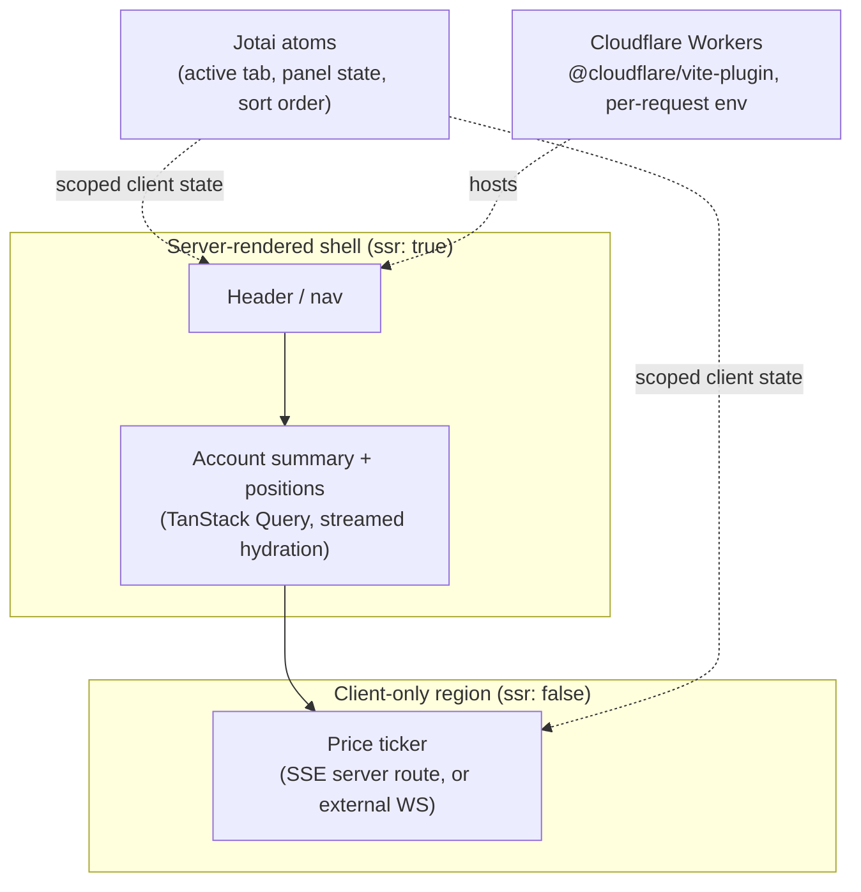

> **Verified against** `@tanstack/react-start` v1.168.x — July 2026.

:::note
This chapter is a narrative, not a repo. This book's code examples are standalone snippets per chapter — there's no shared, growing codebase behind it. What follows walks through *why* you'd reach for each piece, in order, and links to the chapter that actually teaches it. If you want runnable code, follow the links; this chapter's job is showing how the pieces fit, not re-teaching them.
:::

## The brief

You're building a trading dashboard: account info and positions in the header, a scrolling list of live prices below, and it needs to feel instant — both on first load and on every price tick. That single sentence already implies four different rendering and data decisions, and getting any one of them wrong either slows the page down or ships stale prices. This is the same shape covered end-to-end in the [trading/real-time pattern](../../06-patterns/03-trading-realtime-pattern/) — this chapter walks through *arriving* at that shape decision by decision, rather than starting from the answer.

## Step 1: decide what's server-rendered and what isn't

Account balance, name, positions — this barely changes between requests and is exactly the kind of thing worth server-rendering: fast, indexable, no loading spinner on first paint. Live prices are the opposite — they're stale before the HTML even finishes downloading, so server-rendering them buys nothing.

That split *is* the [shell pattern](../../06-patterns/01-shell-pattern/): a server-rendered layout wrapping a client-only region. In file-routing terms, the dashboard's parent route stays `ssr: true`; the price-ticker route nested inside it is `ssr: false`. The account shell and the live region are architecturally separate from the first line of code, not bolted together later.

```
routes/
  dashboard.tsx           <- ssr: true, the shell: header, nav, account summary
  dashboard.prices.tsx    <- ssr: false, client-only price ticker
```

## Step 2: account data through Query

The account summary and positions in that shell are exactly what the [official Query integration](../../04-state-and-data/01-tanstack-query/) is for — server-rendered on first load via streaming dehydration/hydration, then kept fresh with normal Query semantics (`staleTime`, background refetch, cache invalidation on trade actions) without you hand-rolling any of that. This is also the one piece of state management in this whole app that has an official, load-bearing integration — lean on it rather than reaching for something else out of habit.

## Step 3: UI state that isn't server data at all

Not everything on this page is server data. Which watchlist tab is active, whether the order ticket panel is expanded, local sort order on the positions table — none of that belongs in Query, and none of it needs to survive a page reload. This is the case the [decision framework](../../04-state-and-data/03-decision-framework/) draws a hard line on: server data goes through Query (or DB); ephemeral client UI state goes through a client state tool, and the two shouldn't be blurred together.

For that client UI state, [Jotai](../../04-state-and-data/04-zustand-vs-jotai/) is the pick this book lands on for Start apps — atoms scope naturally per-component-tree, which sidesteps the per-request isolation problem that a naive module-level store runs into under SSR (see [the singleton-leak bug class](../../04-state-and-data/05-singleton-leak-bug-class/) for exactly what goes wrong if you get this backwards on the server).

## Step 4: live prices, without pretending Start has WebSockets

Here's the part that's easy to get wrong by assuming it works like every other meta-framework: Start has no native WebSocket support today. The price ticker can't be "just open a socket in a loader." The supported pattern — covered in full in the [trading/real-time pattern](../../06-patterns/03-trading-realtime-pattern/) — is a server route returning a `ReadableStream` in SSE form, or connecting the client directly to a separate WebSocket service that isn't Start itself.

Either way, this lives entirely inside the client-only `dashboard.prices.tsx` route from Step 1. The shell doesn't know or care how prices arrive — it just renders a region that opted out of SSR, and that region owns its own connection lifecycle.

## Step 5: ship it somewhere edge-latency actually matters

A trading dashboard is the textbook case for caring about edge latency — users watching a price ticker notice round-trip time in a way a marketing page never surfaces. That points at [Cloudflare Workers](../../08-deployment/02-cloudflare-workers/) as the deployment shape: `@cloudflare/vite-plugin` ahead of `tanstackStart()` in the plugin list, `wrangler.jsonc` pointed at Start's server entry, and — because this app almost certainly reads per-tenant or per-session config on every request — the per-request `env` discipline from that chapter isn't optional here, it's the difference between working and leaking state across users on a shared isolate.

## How it fits together



Nothing above is new API surface — it's five decisions, each answered by a chapter that already exists in this book, composed in the order a real build would actually hit them. That composition, not any single piece, is the actual skill this capstone is trying to demonstrate.
